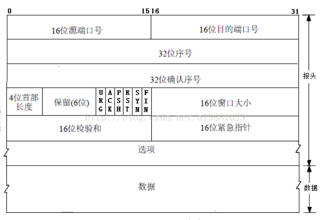
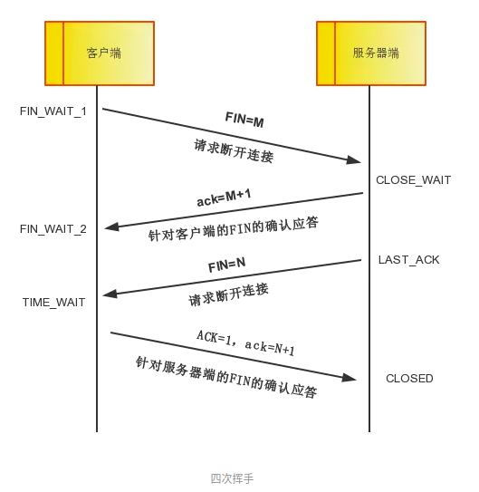
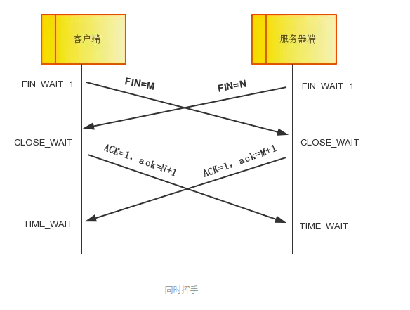

<!-- TOC -->

   * [计算机网络部分常见知识](#计算机网络部分常见知识)
      * [OSI七层模型](#osi七层模型)
         * [OSI网络互联模型为什么要分层?](#osi网络互联模型为什么要分层)
      * [TCP/IP](#tcpip)
         * [HTTP(HyperText Transfer Protocol)(应用层协议)](#httphypertext-transfer-protocol应用层协议)
         * [HTTPS(HyperText Transfer Protocol Secure) (应用层协议)](#httpshypertext-transfer-protocol-secure-应用层协议)
         * [SMTP(Simple Mail Transfer Protocol) (应用层协议)](#smtpsimple-mail-transfer-protocol-应用层协议)
         * [POP3(Post Office Protocol 3)](#pop3post-office-protocol-3)
         * [IMAP(Internet Mail Access Protocol)](#imapinternet-mail-access-protocol)
         * [DNS(Domain Name System) (应用层协议)](#dnsdomain-name-system-应用层协议)
         * [FTP(File Transfer Protocol)(应用层协议)](#ftpfile-transfer-protocol应用层协议)
         * [SFTP(Secure File Transfer Protocol) (应用层协议)](#sftpsecure-file-transfer-protocol-应用层协议)
         * [Telnet / SSH(Secure Shell) (应用层协议)](#telnet--sshsecure-shell-应用层协议)
         * [TCP协议(Transmission Control Protocol)](#tcp协议transmission-control-protocol)
         * [TCP为什么可靠性较高?](#tcp为什么可靠性较高)
         * [UDP协议(User Datagram Protocol)](#udp协议user-datagram-protocol)
         * [TCP与UDP主要区别](#tcp与udp主要区别)
         * [TCP如何保证可靠性传输?](#tcp如何保证可靠性传输)
         * [为什么需要三次握手?](#为什么需要三次握手)
         * [TCP三次握手的过程](#tcp三次握手的过程)
         * [为什么需要四次挥手?](#为什么需要四次挥手)
         * [TCP四次挥手的过程](#tcp四次挥手的过程)
         * [TCP粘包和半包问题](#tcp粘包和半包问题)
         * [解决TCP消息无边界的办法主要有以下几种:](#解决tcp消息无边界的办法主要有以下几种)
      * [HTTP](#http)
         * [HTTP协议的特点](#http协议的特点)
         * [Cookie和Session的区别](#cookie和session的区别)
         * [没有Cookie是否依然能实现Session?](#没有cookie是否依然能实现session)
         * [重定向和转发的区别](#重定向和转发的区别)
         * [GET和POST区别](#get和post区别)
         * [常见HTTP状态码](#常见http状态码)
         * [301与302的区别](#301与302的区别)
         * [HTTP请求方法](#http请求方法)
         * [URI,URL,URN](#uriurlurn)

<!-- /TOC -->

## 计算机网络部分常见知识

PS: 部分图来自网上的文章，如有侵权，请联系俺，俺会立即删除。

````text
如有错误之处，敬请指教。
````

### OSI七层模型
>OSI(Open System Interconnect开放式系统互联)。

**它是ISO(国际标准化组织)提出的网络互联模型。
OSI模型定义了网络互联的7层框架:
应用层，表示层，会话层，传输层，网络层，数据链路层，物理层。**


#### OSI网络互联模型为什么要分层?
>分层可以把开放系统中信息交换的问题分解到具体的层级之中，
>而各层可以对各自的功能独自做出修改和扩展，体现了解耦的思想。

1.物理层
>物理层的作用是利用光纤，电缆，双绞线等传输介质来传输比特流(光，电等信号)。
>需要ISP(Internet Service Provider)互联网提供商的支持。

2.链路层
>链路层的作用是当网络层数据传输前，将数据封装成帧。
>一个帧由一个数据字段和若干首部字段组成，网络层的数据报就存于数据字段中。
>当帧中的数据作为bit传输时，
>接收方可能会判断错误，如0判断成1。
>这种错误是由于在数据发送过程中外部因素如电磁噪声干扰所致，
>许多链路层协议就提供了一种纠错机制，通过让发送节点在帧中包括差错bit，
>让接受节点进行差错检查。

3.网络层
>网络层主要负责数据的数据链路的寻址和路由选择。
>网络层的协议主要有:IP,ICMP等。

4.传输层
>传输层提供端口到端口的可靠的数据传输服务。传输层的协议主要有TCP和UDP。

5.会话层
>会话层的作用是负责建立，管理和终止主机之间的通信连接。

6.表示层
>表示层主要的作用是负责数据格式的转换:
>将应用层的数据转换为网络传输的格式，
>或者将来自下一层的数据转为应用层协议能够处理的格式。
>除此之外，数据的压缩解压，加密解密也都由表示层完成。

7.应用层
>应用层为应用程序提供SPI(Service Provider Interface)应用程序接口。
>应用层协议是为应用程序提供服务保证的协议。

### TCP/IP
**TCP / IP 不仅仅是指TCP和IP这两种协议，而是一系列网络协议的总和，
而这些协议中最核心的2个协议就是TCP和IP，所以被称为TCP/IP网络协议族。
TCP/IP协议族是互联网的基础通信架构。**

#### HTTP(HyperText Transfer Protocol)(应用层协议)
**HTTP超文本传输协议。**
>是用于Web浏览器和Web服务器之间传递数据的协议。
>HTTP协议以明文的方式发送内容，不提供任何方式的数据加密，
>因此HTTP是一种不太安全的协议。

#### HTTPS(HyperText Transfer Protocol Secure) (应用层协议)
>HTTPS协议在HTTP协议的基础上加入了SSL协议，
>SSL依靠证书来验证服务器的身份，
>所以HTTPS协议叫HTTP协议来说是安全的。
>SSL协议作用于传输层协议和各种应用层协议之间。

#### SMTP(Simple Mail Transfer Protocol) (应用层协议)
**SMTP简单邮件传输协议。**
>它是用于从源地址到目标地址传输邮件的协议(发送邮件)

#### POP3(Post Office Protocol 3)
**POP邮局协议的第3个版本。**
>POP3协议允许电子邮件客户端下载服务器上的邮件，
>但是在客户端上的操作，并不会反馈到服务器上。
>也就是说客户端的操作对服务端没有影响。(接受并处理邮件)

#### IMAP(Internet Mail Access Protocol)
**IMAP交互式邮件存取协议**。
>它和POP3协议类似 ，但是IMAP对客户端的操作会反馈到服务端,
>也就是说客户端邮件的状态与服务端邮件的状态是一致的。(接受并处理邮件)

#### DNS(Domain Name System) (应用层协议)
**DNS域名系统。**
>DNS服务器可以看做是一个域名与IP地址相互映射的分布式数据库。
>我们使用浏览器访问google的时候需要输入:google.com,
>浏览器会帮我们到DNS服务器查询google.com对应的IP地址，
>从而能够访问google的服务器。

#### FTP(File Transfer Protocol)(应用层协议)
**FTP文件传输协议。**
>FTP协议用于从一台主机将文件传输到另一台主机上。
>但FTP协议在文件传输过程中，并没有为文件提供加密措施，
>所以FTP协议是不安全的。

#### SFTP(Secure File Transfer Protocol) (应用层协议)
**SFTP安全文件传输协议。**
>SFTP实际可以看做是SSH的一部分。
>当使用SFTP登录到目标主机后，可以使用SFTP指定的命令进行数据传输，
>并且传输的数据是加密过的。

#### Telnet / SSH(Secure Shell) (应用层协议)
>Telnet和SSH都可以作为远程登录的协议。
>但Telnet使用的是明文来传输数据，并且没有提供数据加密措施，
>是不安全的协议。
>而SSH协议则提供了对数据的压缩和加密，比Telnet要安全的多。
>所以现在几乎大部分场景都使用的是SSH作为安全数据传输和远程登录的协议，
>并且SSH提供了对SFTP的支持。

#### TCP协议(Transmission Control Protocol)
TCP传输控制协议。
>TCP协议是一种面向连接的，可靠的，基于字节流的传输协议。
>TCP协议适用于对数据准确性和可靠性要求较高的应用，如文件传输等。

#### TCP为什么可靠性较高?
>TCP会采用校验和，确认应答与序列号，
>拥塞控制，流量控制，超时重传，
>连接管理(三次握手，四次回收)等机制保证传输的可靠性。

**TCP报文格式:**



#### UDP协议(User Datagram Protocol)
UDP用户数据报协议。
>与TCP协议不同，UDP协议并不保证数据传输的可靠性，
>无论目标主机是否可通信，UDP都会发送数据。
>
>UDP适用于传输效率要求较高，允许一定数据丢失的应用，如语音，视频等。

**PS:UDP报文格式**


#### TCP与UDP主要区别
* TCP基于连接，数据传输前需要做好可靠性准备工作(三次握手);而UDP是无连接的，只要有数据就可发送了。
* TCP使用流量控制和拥塞控制等措施使传输更加可靠；而UDP则是不可靠的传输。
* TCP是面向流的数据模式(无边界)；而UDP是面向报文的数据模式(有边界)。
* TCP仅支持单播，点对点的数据传输；而UDP不仅支持单播，还支持组播，广播。
* TCP首部开销较大(最大60字节，最小20字节);UDP首部开销较小(8字节)。

#### TCP如何保证可靠性传输?
* 校验和(16位)
>在数据传输过程中，将发送的数据段分成若干个16位的整数。
>将这些整数加起来，并且前面的进位不能丢弃，补在后面，最后取反，
>得到校验和。
>
>发送方在发送数据之前计算校验和，并将校验和填充到TCP报文中，
>而接收方收到数据后，对数据以同样的方式进行计算，求出校验和，
>与发送方的进行比对。如果比较失败，接收方将丢弃数据包。

* 确认应答ACK和序列号(32位)
>在TCP传输过程中，每次接收方收到数据后，都会对发送方进行应答，
>也就是响应ACK报文，这个报文中有对应的确认序列号。

* 超时重传
>在TCP传输时，由于确认应答和序号机制，当发送方发送完数据后，
>会等待接收方的ACK报文，并解析判断ACK报文(一般来说ACK为seq+1)，
>如果发送方一直没有等到接收方的ACK报文，那么将重新发送一遍数据。

* 连接管理
>连接管理是TCP数据传输前和连接断开时的工作，
>包括三次握手与四次挥手的过程。

* 流量控制(滑动窗口)
>TCP连接发送端和接收端都有一个缓冲区，如果发送端的发送数据过快，
>导致接收端来不及处理数据，缓冲区就被填充满了，那么接下来的数据，
>接收方就会丢弃数据，导致丢包等连锁反应产生。
>
>**TCP根据接收端的处理能力，来决定发送端的发送速度，这个机制就是流量控制。**
>**TCP的报文中，有一个16位的窗口字段，
>窗口大小就是接收端计收数据缓冲区的剩余大小，这个数字越大，
>代表接收端缓冲区的剩余空间越大。**
>
>接收端在发送ACK确认报文时，会将自己当前的窗口大小填入，
>这样发送方就会根据ACK报文里的窗口大小的值改变自己的发送速度。
>如果接收方窗口大小的值为0，那么发送方将停止发送数据，
>并定期的向接收端发送窗口探测数据，让接收端把窗口大小告诉发送端。

* 拥塞控制(拥塞窗口)
>滑动窗口是接收端的使用的窗口大小，用来告诉发送端接收端的缓存大小，
>从而可以控制发送端的发送速度。
>而发送端发送的速度则是使用发送端的窗口来实现的。

**发送端的窗口就是拥塞窗口了，发送端的拥塞窗口不代表缓存，
而是指发送端每次最多可以发送的数据包数。**

>当TCP连接建立时，拥塞窗口被初始化为1，每次发送数据后，
>收到一个ACK，拥塞窗口就增加一个报文段，
>发送端取拥塞窗口与滑动窗口的最小值作为发送上限，从而实现拥塞控制。
>
>如果网络比较拥堵，那么一次性发送大量数据将，可能产生大量的丢包，
>继而发生一系列的连锁反应，如超时重传等。
>拥塞控制就避免了一次性发送过多的数据，而导致的问题。

#### 为什么需要三次握手?
>TCP是面向连接的，三次握手是客户端与服务端进行数据传输前的准备工作。
>这样做是为了建立可靠的传输信道，尽可能的保证数据的安全。

#### TCP三次握手的过程
三次握手是指建立一个TCP连接时需要客户端和服务端总共需要发送3个数据包确认连接的建立。

TCP三次握手的过程:


1.第一次握手
>客户端发送一个数据包发送给服务端。
>该数据包的标志位SYN=1，表示客户端请求建立连接，
>随机产生的序列号seq=J。
>客户端进入SYN_SENT状态，等待服务端确认。

2.第二次握手
>服务端收到客户端的数据包后，由标志位SYN=1判断客户端需要建立连接。
>于是响应一个确认数据包给客户端。
>该确认数据包的标志位SYN和标志位ACK都为1，确认序列号ack=J+1,
>随机产生的序列号seq=K。服务端进入SYN_RCVD状态。

3.第三次握手
>客户端收到服务端的确认数据包后，检查确认序列号ack是否为J+1,
>标志位ACK是否为1。
>如果正确则将发送最后一个数据包给服务端。
>该数据包的标志位ACK为1,确认序列号ack=K+1。
>服务端收到后检查确认序列号ack是否为K+1,标志位ACK是否为1。
>如果正确，则客户端和服务端都进入ESTABLISHED状态。

三次握手后，客户端和服务端就可以传输数据了。

#### 为什么需要四次挥手?
>四次挥手是客户端与服务端关闭连接时的结尾工作。
>TCP是全双工的，即:客户端可以通过这条TCP连接向服务端发送数据(上传)，
>服务端也可以通过这条TCP连接向客户端发送数据(下载)。
>因此，客户端和服务端都需要单独的关闭连接。
>客户端关闭连接是关客户端到服务端的通信传输，
>而服务端关闭连接是关闭服务端到客户端的通信传输，
>所以需要四次挥手来保证2端的关闭。

#### TCP四次挥手的过程
四次挥手是指断开连接时，客户端与服务端总共需要发送4个数据包确认连接的断开。
客户端或服务端任意一方都可以发送断开连接的请求。

TCP四次挥手的过程:



1.第一次挥手(假设客户端请求断开)
>客户端发送一个数据包给服务端，用于关闭Client到Server的数据传输。
>数据包的标志位FIN=1，随机产生的序号seq=M，客户端进入FIN_WAIT_1状态。

2.第二次挥手
>服务端收到客户端的断开请求后，将发送一个数据包响应给客户端。
>该数据包的标志位ACK=1，确认序列号ack=M+1。
>客户端收到后进入FIN_WAIT_2状态，服务端进入CLOSE_WAIT状态。

3.第三次挥手
>服务端发送一个数据包给客户端，用于关闭服务端到客户端的数据传输。
>数据包的标志位FIN=1，随机产生的序列号seq=N。
>服务端进入LAST_ACK状态。

4.第四次挥手
>客户端收到服务端的断开请求后，就可以关闭连接了。
>于是发送最后一个数据包结束与服务端的连接，并进入TIME_WAIT状态。
>最后一个数据包的标志位ACK=1，确认序列号ack=N+1。
>服务端收到最后一个了数据包后，就关闭了连接，状态就为CLOSED，
>如果服务端没有收到ACK,客户端可以重传。客户端等了一会儿，
>最终没有收到响应，就代表服务端已经关闭连接了，客户端也就会关闭连接。

上面是客户端或服务端中的一段主动关闭，另一段被动关闭，
实际还可能还会出现同时发起关闭的情况:



#### TCP粘包和半包问题
在TCP传输数据时，客户端发送数据，实际上是把数据写入到了TCP的缓冲区中，
粘包和半包也就可能在此时产生。

>假设客户端给服务端发送两条数据: "ABC"和"DEF"，
>服务端这边的接受可能会有多种情况:
>可能是一次性收到了这两条消息:"ABCDEF",
>也有可能分批收到了消息:"ABC","DEF"或"AB","CD","EF"。

服务端一次性收到了所有数据包，这种情况就是粘包了。 

>如果客户端发送的包的大小比TCP的缓冲区要小，
>并且TCP的缓冲区可以存放多个包，客户端一次性就可能能向服务端发送多个包，
>这时服务端从TCP缓冲区中就可能读取多个包，这种现象就叫粘包。

服务端分批收到数据包，这种情况就是半包了。

>如果客户端发送的包的大小比TCP缓冲区要大，
>那么这个数据包就可能被分为多个包，就需要多次发送，
>而服务端第一次从缓冲区里获取的数据只是整个数据包的一部分，
>这时候就产生了半包。

**粘包的主要原因是:
发送端发送的数据大小 < Socket缓冲区大小，
服务端一次性就读取了Socket缓冲区数据。**

**半包的主要原因是:
发送端发送的数据大小 > Socket缓冲区大小，
服务端读取数据不够及时，只读取到了数据的一部分。**

**总结起来就是:多次发送可能共用一个传输，一个发送可能多占用多个传输。**

>其实归根到底，究其根本原因是:

**TCP是面向字节流的协议，消息之间没有边界。
而UDP虽然也可以一次性传输多个包或者多次传输一个包
但UDP的每个消息都是有边界的，因此不会有粘包和半包问题。**

#### 解决TCP消息无边界的办法主要有以下几种:
* 固定长度:这种方式是为消息设定一个固定长度。
>这样所虽然实现简单，但缺点很大，如果消息的大小本身就比较小，
>那么这样做就很浪费空间了。

* 分隔符:这种方式是为消息边界添加分隔符。
>这样做实现也是比较简单，也不再浪费空间，
>不过当内容本身也有分割符时，那就需要转义了，
>就可能需要对整个内容进行扫描，效率上就比较低。

* 添加数据的长度字段:这种方式是为报文添加一个Length字段，存储消息的长度。
>在Http协议的报文中，有一个字段为Content-Length，专门存储数据的长度。 
>这种方式是比较好的。

### HTTP

#### HTTP协议的特点
* 适用于客户端与服务端的通信架构
>如果一个应用使用了HTTP协议，那么肯定要有一端作为客户端，
>另一段作为服务端，请求又客户端发出，服务端处理并返回请求的结果。

* 无状态
>无状态是指HTTP协议不对请求和响应之间的通信状态进行保存，
>协议对于发送过的请求或响应的结果都不做持久化处理。
>但无状态就意味着每个请求都是独立的，
>后续的请求如果需要用到前面使用过的信息/数据则需要重传，
>这可能导致后续连接的数据较大。
>于是Cookie和Session就应运而生。
>Cookie和Session可以保存用户的状态信息或数据。

* 无连接
>无连接是指每次TCP连接只处理一个请求，服务端处理完客户端的请求后，
>立刻断开连接。采用这种方式，可以节省传输时间。
>但是这样做的缺点也很明显，每个TCP连接只处理一个请求，
>这样做不仅浪费资源，而且每次请求都需要建立连接，这就使得请求的效率也很低。
>
>从HTTP/1.1开始支持Keep-Alive功能，
>Keep-Alive使得客户端与服务端的连接持续有效，
>当客户端对服务端有多个请求时，都会使用这一条连接。 
>当超过Keep-Alive规定的时间，或者出现其他意外的情况时，
>客户端与服务端的连接才会被断开。

#### Cookie和Session的区别
>Cookie是在客户端保存用户信息的一种机制，
>用于记录用户的一些状态信息。
>每一次客户端向服务端发出请求，都会携带Cookie信息。
>
>而Session是在服务端保存用户信息的一种机制。
>一个Session对应一个客户端，当客户端第一次请求服务端时，
>客户端就会被分配一个唯一SessionId，该SessionId依赖于Cookie，
>被存储在客户端。
>因为SessionId采用Cookie保存，所以每次客户端请求服务端，
>也都会携带该SessionId，这样，服务端就能根据SessionId识别客户端身份。

#### 没有Cookie是否依然能实现Session?
>个人认为是可以的。
>Session将SessionId保存在客户端的Cookie中，
>而Cookie不过是客户端保存请求状态的一种机制而已，
>使用其他技术当然也可以实现这种机制，
>如LocalStorage/SessionStorage也可以存储。

#### 重定向和转发的区别
1. 转发是服务端行为,客户端是无法感知转发的。重定向则是客户端行为。
2. 转发属于一次请求，而重定向是客户端需要发送第二次请求。

#### GET和POST区别
GET和POST都是HTTP请求的一种方式，而HTTP协议是基于TCP协议的，
所以GET和POST都是基于TCP协议的。。

>GET请求的语义是从服务器获取资源，无论获取多少次资源，
>数据可能不同，但是并不会对资源造成任何影响。
>所以我认为是无副作用的，是幂等的，是可缓存的。
>
>而POST请求的语义是在服务器上创建资源，是会产生副作用的。
>相同的2次POST请求会创建两份资源，因此POST请求是非幂等的，是不可缓存的。
>
>其他方面，个人认为没啥不同。
>只是对于不同的浏览器，GET请求和POST请求在这些浏览器上的表现也不同，
>如GET请求和POST请求的URL长度不同等等。

#### 常见HTTP状态码
HTTP状态码:
* 1** : 指示信息。服务端收到请求，继续执行操作。
* 2** : 成功。操作被成功接受并处理。
* 3** : 重定向。需要进一步的操作来完成请求。
* 4** : 客户端错误。由于客户端请求的错误，服务端无法处理请求。
* 5** : 服务端错误。服务端在处理请求的过程中发生了错误。

#### 301与302的区别
301和302都代表客户端请求的资源发生了转移。
不同之处在于:
301: 客户端请求的资源已被永久移动到了新的位置，客户端会自动重定向新URL。
客户端以后的请求应该都使用新的URL。
302: 客户端请求的资源被临时移动到了新的位置，客户端可以继续使用原URL。

#### HTTP请求方法
1. GET
2. POST
3. PUT
4. DELETE
5. HEAD
6. PATCH
7. OPTION
8. TRACE
9. CONNECT

#### URI,URL,URN

**URI ( uniform resource identifer):统一资源标识符**
>URI是一个互联网资源的唯一标识，但它并不代表资源在互联网上的位置，
>它对于资源的作用相当于身份证号码对于我们的作用，起一个唯一标识的作用。

**URL (uniform resource locator) : 统一资源定位符**
>URL是URI的子集，URL标识了资源在互联网上的位置，
>一个URL只能访问到一个资源，

**所以URL有着和URI相同的作用:都可以作为资源的唯一标识符，但URL也有URI没有的作用:对资源的定位。**

**URN(uniform resource name):统一资源名称**
>URN也是URI的子集，URN是对资源的命名，不能像URL一样对资源定位。
