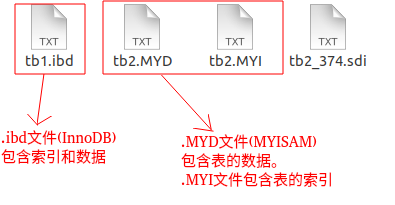
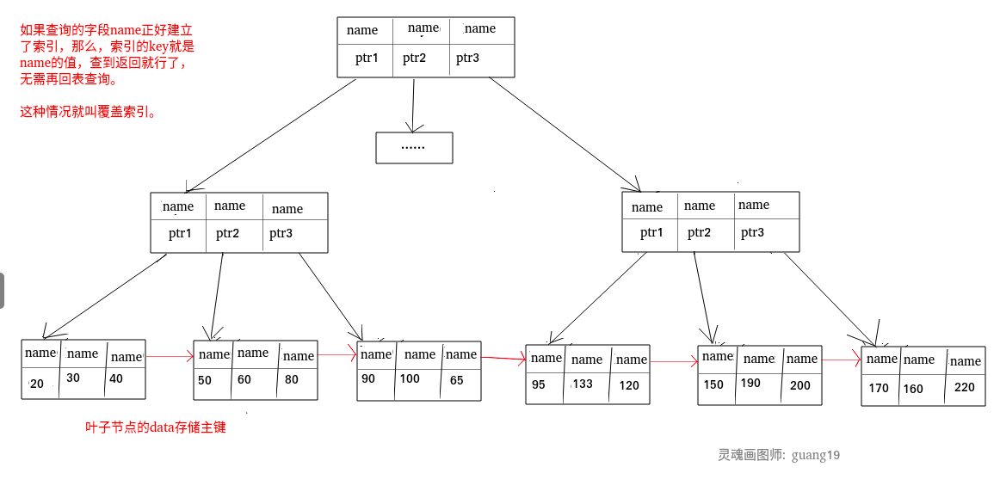
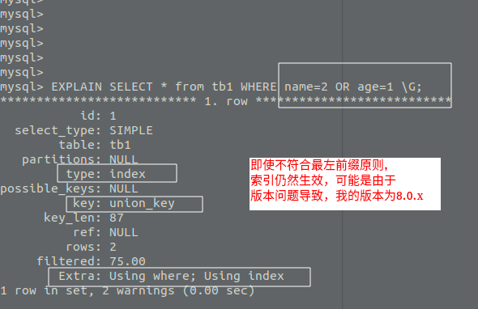

## 数据库部分常见知识

````text
如有错误之处，敬请指教。
````

### RDBMS(Relation Database Manager System)
>关系数据库管理系统。
>关系数据库关系系统是管理关系型数据库的软件系统。

#### 什么是关系型数据库?
>关系型数据库是指采用了关系模型来组织数据的数据库。
>关系型数据库以行和列的形式来存储数据，以便于用户理解。
>关系型数据库一系列的行和列的集合被称为数据表，而数据库则由一组表构成。

#### 数据库设计范式(Normal Form)?
* 第一范式:所有字段都是不可分解的原子属性。
>假设在一张用户表中有一个字段为地址。
>但地址其实就不是一个原子属性，
>因为地址可以分成: 国家 + 省份 + 城市 + 区域 + 街道等属性，
>所以需要以最小粒度为单位设置表的属性。比如年龄，它仅仅代表年龄，并不能再分割。

* 第二范式:第二范式在第一范式的基础上，所有属性必须依赖于主键，不能依赖部分主键。
>一个表必须所有的非主键属性都必须依赖于主键，而且不能只依赖部分主键，
>假设有一张学生教师表，字段为:
>学号，学生姓名 ，教师编号，教师姓名。

| 学号(PK)|学生姓名 | 教师编号(PK) | 教师姓名　|  
| :----:| :----: | :----: |  :----: |
| 1 |　guang19 | 1 | qsjz|   

>其中学号与教师编号为联合主键，学生姓名依赖于学号，而并不依赖于教师编号，
>所以学生表不符合第二范式。
>
>正确的做法是将学生教师表拆分为2张表:学生表和教师表:
>学生表的字段为:学号，学生姓名。
>教师表的字段为:教师编号，教师姓名。

学生表:

| 学号(PK)|学生姓名 | 
| :----:| :----: |
| 1 |　guang19 | 
 
教师表:

| 教师编号(PK)|教师姓名 | 
| :----:| :----: |
| 1 |　qsjz |  

* 第三范式:第三范式在第二范式的基础上，属性不能间接依赖于主键，必须直接依赖于主键。
>假设有一张学生表的字段为:
>学号，学生姓名，班级编号，班级名称。

| 学号(PK)|学生姓名 | 班级编号 | 班级名称　|  
| :----:| :----: | :----:| :----: |
| 1 |　guang19 | 1 | qsjz5|   

>其中学号为主键，但是班级名称依赖于班级编号，班级编号再依赖于学号。
>这样班级名称与学号之间并不是直接性依赖，而是传递性依赖。
>
>可以将学生表拆分为:学生表和班级表，其中:
>学生表的字段为: 学号，学生姓名，班级编号。
>班级表的字段为:班级编号 ， 班级名称。

学生表:

| 学号(PK)|学生姓名 | 班级编号 |
| :----:| :----:| :----: |
| 1 |　guang19 | 1 |

班级表:

| 班级编号(PK)|班级名称 |
| :----:| :----: |
| 1 |　qsjz5 |


>学生表的班级编号与班级表的班级编号就属于一种外键关系了，
>2张表中也不再有传递依赖性的依赖关系了。

#### 键是什么?
>键是描述数据表中某些特殊的属性列。

```text
假设有一个学生表和一个班级表:
学生表有: 学号，身份证号，性别等属性
班级表有: 班级id，班级名等属性.
```
#### 超键 / 候选键 / 主键 / 外键？
* 超键:超键是能唯一标识数据表中的记录的属性集的集合。
>超键可以是一个属性，也可以是属性组合。
>如学生表中的学号可以作为学生的唯一标识，
>身份证号也可以作为学生的唯一标识,那么与这2个属性任意搭配的集合，
>都可以作为学生表的超键:
>{{学号}，{身份证号},{学号,身份证号}，{学号，性别}，{身份证号，性别}...}等等。

* 候选键:候选键是能唯一标识数据表中的记录的属性的集合。
>可以把候选键看作是最小粒度的超键，即没有冗余的超键。
>学生表中的候选键为:{{学号}，{身份证号}}。
>但是不能有{学号，身份证号}，因为学号和身份证好同时存在就不是最小粒度了。

* 主键:主键是能唯一标识数据表中的记录的属性列。
>看起来主键和候选键区别不大。
>但是候选键可以是一个集合,同时包括{学号},{身份证号}，
>而主键是从候选键里选出一个出来，要么是{学号}，要么是{身份证号}。(不考虑联合主键哈)

* 外键:外键是约束一个数据表和另一个数据表表的关系的属性列。
>如何确定学生在哪个班级呢?或者说如何确定某个班级有哪些学生呢?
>一个班级可以有多个学生.这就属于一对多关系。
>可以在学生表中加一个班级id的外键列，与班级表的班级id关联，
>这样就可以确定学生与班级的关系了。

#### 视图是什么?
**视图是一种展示数据表特定结果的虚拟表。**
>它主要用来做查询结果集的展示。

#### 视图与表有什么不同?
**数据表是存在物理文件中的，而于视图是虚拟存在的内存表。**
>它实际上是一条编译好的Select SQL语句，没有任何数据。
>对视图的增删该查等操作实际上是对视图的基表的操作。

#### 视图的优点
>视图的优点主要在于可以定制用户数据，让用户关注于其自定义数据本身，而不用理会无关的数据。

#### 视图的缺点
>视图的主要缺点在于修改限制。
>虽然视图主要是用来做结果集的查询展示的，
>但是仍然可以对视图做出修改的操作(实际上是对基表做出修改)。
>如果一个视图由多张基表的结果集组成，那么修改操作会变得很麻烦。

#### 存储过程是什么?
当用户使用DML SQL语句操作数据库时，数据库需要编译SQL后再执行。
**而存储过程则是用户为了完成特定的任务，
而预先在数据库中定义好并经过数据库编译后的一组SQL，
用户通过指定存储过程的名字和参数来调用存储过程。**
```text
存储过程类似于编程语言中的方法函数。 
```

#### 存储过程的优点
>存储过程的优点主要在于它允许我们像编写函数一样定义SQL语句，非常的灵活。
>并且存储过程是直接经过预编译直接存储在内存之中的，执行速度是很快的。

#### 存储过程的缺点
>存储过程的缺点主要在于耗费数据库的资源，如果存储过程过多，
>那么占用的内存也是越多的。
>
>有的文章说存储过程的可移植性差，
>但应用程序的技术选型不应该是预先敲定的吗?

#### 触发器是什么?
>触发器是在指定表上，当满足指定条件时会执行的SQL语句的集合。
>可以把触发器看做是特殊的存储过程，不过存储过程需要手动调用，
>而触发器则是满足指定条件就会被触发。
```text
触发器的触发事件有: UPDATE,DELETE,INSERT
触发时间有:Before,After
```
触发器缺点同存储过程一样。 

#### DDL,DML,DCL,DQL,TCL
* DDL(Data Define Language:数据定义语言)
>DDL的功能是用于定义数据库中的模式(Schema)，模式包含了表，视图，存储过程等集合。
>这里准确来说应该是定义数据库的三级模式:外模式，模式(逻辑模式，概念模式)和内模式。
>
>DDL的关键字有: CREATE , ALTER , DROP等

* DML(Data Manipulation Language:数据操纵语言)
>DML的功能是用于操作数据库中的数据。
>
>DML的关键字有: SELECT , DELETE , UPDATE , INSERT等。

* DCL(Data Control Language:数据控制语言)
>DCL的功能是用于设置数据库的用户权限。
>
>DCL的关键字有: GRANT,REVOKE等。

* DQL(Data Query Language:数据查询语言)
>数据查询语言，个人认为它应该是属于DML的。
>
>主要关键字就是SELECT了。

* TCL(Transaction Control Language:事务控制语言)
>TCL的功能是用于管理事务。
>
>TCL的关键字有: BEGIN , COMMIT , ROLLBACK等。

---

#### 连接
连接分为:内连接，外连接和交叉连接。

* 内连接
>内连接只返回表的匹配的数据。

* 外连接
```text
外连接分为:左外连接，右外连接和全外连接
```
        1.左外连接
>>>左外连接会返回左表所有的行，即使右表中不匹配的行。

        2.右外连接
>>>右外连接返回右表所有的行，即使左表中没有匹配的行。

        3.全外连接
>>>全外连接返回所有表的所有行，即使表的数据不匹配。

* 交叉连接
>交叉连接又称为笛卡尔积，它不同于其他连接，交叉连接无需指定条件。
>
>它将一张表的每一行与另一张表的所有行全部匹配一遍，
>效率非常低，而且使用交叉连接的情况较少。

#### 联合主键和复合主键
```text
网上有文章说联合主键和复合主键有区别，但我个人认为没区别。
```

**在我看来联合主键和复合主键都是以多个属性列共同组合的主键，
它们以组合的形式保证数据的唯一性。**

>有的同学说联合主键是多个主键组合成的主键，
>而我想反驳:一个表只有一个主键呀，哪来的那么多主键。
>我估摸着有同学大概是想说唯一属性的列组成的主键吧，那还不是属于组合主键。。

当然，也可能是我功力不足，认识不到吧。

---

### 索引

#### 什么是索引?
**索引是一种用于快速查询和检索数据的数据结构。
见的索引结构有: B树， B+树和Hash。**

>打个比方: 我们在查字典的时候，如果没有目录，
>那我们就只能一页一页的去找我们需要查的那个字，速度很慢。
>
>如果有目录了，我们只需要先去目录里查找字的位置，然后直接翻到那一页就行了。

**索引的作用就相当于目录的作用。**

#### 索引的优点
**索引最大的优点就是数据的检索效率高，这也是为什么要创建和使用索引的原因。
毕竟大部分系统的读请求总是大于写请求的。**

#### 索引的缺点
* 创建索引和维护索引需要耗费许多时间。
>当对表中的数据进行增删改的时候，如果数据有索引，
>那么索引也需要动态的修改，会降低SQL执行效率。

* 占用物理存储空间
>索引需要使用物理文件存储，也会耗费一定空间。

#### B树和B+树区别
* B树的所有节点既存放 键(key) 也存放 数据(data);
而B+树只有叶子节点存放 key 和 data，其他内节点只存放key。

* B树的叶子节点都是独立的;B+树的叶子节点有一条引用链指向与它相邻的叶子节点。

* B树的检索的过程相当于对范围内的每个节点的关键字做二分查找，
可能还没有到达叶子节点，检索就结束了。
而B+树的检索效率就很稳定了，任何查找都是从根节点到叶子节点的过程，
叶子节点的顺序检索很明显。


#### Hash索引 和 B+树索引 优劣
* Hash索引定位快
>Hash索引指的就是Hash表，最大的优点就是能够在很短的时间内，
>根据Hash函数定位到数据所在的位置，这是B+树所不能比的。

* Hash冲突
>知道HashMap或HashTable的同学，相信都知道它们最大的缺点就是Hash冲突了。
>不过对于数据库来说这还不算最大的缺点。

* Hash索引不支持顺序和范围查询(Hash索引不支持顺序和范围查询是它最大的缺点。)
>试想一种情况:

````text
SELECT * FROM tb1 WHERE id < 500;
````

>B+树是有序的，在这种范围查询中，优势非常大，
>直接遍历比500小的叶子节点就够了。
>
>而Hash索引是根据hash算法来定位的，难不成还要把 1 - 499的数据，
>每个都进行一次hash计算来定位吗?这就是Hash最大的缺点了。 

---

### 索引类型

#### 主键索引(Primary Key)
**数据表的主键列使用的就是主键索引。**

**一张数据表有只能有一个主键，并且主键不能为null，不能重复。**

**在mysql的InnoDB的表中，当没有显示的指定表的主键时，
InnoDB会自动先检查表中是否有唯一索引的字段，如果有，
则选择改字段为默认的主键，否则InnoDB将会自动创建一个6Byte的自增主键。**

#### 二级索引(辅助索引)
**二级索引又称为辅助索引，是因为二级索引的叶子节点存储的数据是主键。
也就是说，通过二级索引，可以定位主键的位置。**

唯一索引，普通索引，前缀索引等索引属于二级索引。

**PS:不懂的同学可以暂存疑，慢慢往下看，后面会有答案的，也可以自行搜索。**

1. **唯一索引(Unique Key)**: 唯一索引也是一种约束。**唯一索引的属性列不能出现重复的数据，但是允许数据为NULL，一张表允许创建多个唯一索引。**
建立唯一索引的目的大部分时候都是为了该属性列的数据的唯一性，而不是为了查询效率。

2. **普通索引(Index)**:普通索引的唯一作用就是为了快速查询数据。**一张表允许创建多个普通索引，并允许数据重复和NULL。**

3. **前缀索引(Prefix)**:**前缀索引只适用于字符串类型的数据。**
前缀索引是对文本的前几个字符创建索引，相比普通索引建立的数据更小因为只取前几个字符。

4. **全文索引(Full Text)**:全文索引主要是为了检索大文本数据中的关键字的信息，
是目前搜索引擎数据库使用的一种技术。
Mysql5.6之前只有MYISAM引擎支持全文索引，5.6之后InnoDB也支持了全文索引。

二级索引:
.png)

### 聚集索引与非聚集索引

#### 聚集索引
**聚集索引即索引结构和数据一起存放的索引。**

**主键索引属于聚集索引。**

>在Mysql中，InnoDB引擎的表的.ibd文件就包含了该表的索引和数据，
>对于InnoDB引擎表来说，该表的索引(B+树)的每个非叶子节点存储索引，
>叶子节点存储索引和索引对应的数据。

#### 聚集索引的优点
>聚集索引的查询速度非常的快，因为整个B+树本身就是一颗多叉平衡树，
>叶子节点也都是有序的，定位到索引的节点，就相当于定位到了数据。

#### 聚集索引的缺点
* 依赖于有序的数据
>因为B+树是多路平衡树，如果索引的数据不是有序的，
>那么就需要在插入时排序，如果数据是整型还好，
>否则类似于字符串或UUID这种又长又难比较的数据，插入或查找的速度肯定比较慢。

* 更新代价大
>如果对索引列的数据被修改时，那么对应的索引也将会被修改，
>而且况聚集索引的叶子节点还存放着数据，修改代价肯定是较大的，
>所以对于主键索引来说，主键一般都是不可被修改的。

#### 非聚集索引

**非聚集索引即索引结构和数据分开存放的索引。**

**二级索引属于非聚集索引。**

>MYISAM引擎的表的.MYI文件包含了表的索引，
>该表的索引(B+树)的每个叶子非叶子节点存储索引，
>叶子节点存储索引和索引对应数据的指针，指向.MYD文件的数据。
>
**非聚集索引的叶子节点并不一定存放数据的指针，
因为二级索引的叶子节点就存放的是主键，根据主键再回表查数据。**

#### 非聚集索引的优点
* 更新代价比聚集索引要小
>非聚集索引的更新代价就没有聚集索引那么大了，非聚集索引的叶子节点是不存放数据的

#### 非聚集索引的缺点
* 跟聚集索引一样，非聚集索引也依赖于有序的数据

* 可能会二次查询(回表)
>这应该是非聚集索引最大的缺点了。 
>当查到索引对应的指针或主键后，可能还需要根据指针或主键再到数据文件或表中查询。

这是Mysql的表的文件截图:



聚集索引和非聚集索引:


#### 非聚集索引一定回表查询吗(覆盖索引)?
**非聚集索引不一定回表查询。**

>试想一种情况，用户准备使用SQL查询用户名，而用户名字段正好建立了索引。

````text
 SELECT name FROM table WHERE username='guang19';
````

>那么这个索引的key本身就是name，查到对应的name直接返回就行了，无需回表查询。

**即使是MYISAM也是这样，虽然MYISAM的主键索引确实需要回表，因为它的主键索引的叶子节点存放的是指针。
但是如果SQL查的就是主键呢?**

```text
SELECT id FROM table WHERE id=1;
```

>主键索引本身的key就是主键，查到返回就行了。
>这种情况就称之为覆盖索引了。

#### 覆盖索引
**覆盖索引即需要查询的字段正好是索引的字段，那么直接根据该索引，就可以查到数据了，而无需回表查询。**

>如主键索引，如果一条SQL需要查询主键，那么正好根据主键索引就可以查到主键。
>
>再如普通索引，如果一条SQL需要查询name，name字段正好有索引，
>那么直接根据这个索引就可以查到数据，也无需回表。

覆盖索引:


---

### 索引创建原则

#### 单列索引
单列索引即由一列属性组成的索引。

#### 联合索引(多列索引)
联合索引即由多列属性组成索引。

#### 最左前缀原则
>假设创建的联合索引由三个字段组成: 

```text
ALTER TABLE table ADD INDEX index_name (num,name,age)
```

>那么当查询的条件有为:
>num / (num AND name) / (num AND name AND age)时，索引才生效。
>所以在创建联合索引时，尽量把查询最频繁的那个字段作为最左(第一个)字段。
>查询的时候也尽量以这个字段为第一条件。

**但可能由于版本原因(我的mysql版本为8.0.x),我创建的联合索引，
相当于在联合索引的每个字段上都创建了相同的索引:**

.png)

无论是否符合最左前缀原则，每个字段的索引都生效:



### 索引创建注意点

#### 最左前缀原则
>虽然我目前的Mysql版本较高，好像不遵守最左前缀原则，索引也会生效。
>但是我们仍应遵守最左前缀原则，以免版本更迭带来的麻烦。

#### 选择合适的字段

* 不为NULL的字段
>索引字段的数据应该尽量不为NULL，因为对于数据为NULL的字段，数据库较难优化。
>如果字段频繁被查询，但又避免不了为NULL，建议使用0,1,true,false
>这样语义较为清晰的短值或短字符作为替代。

* 被频繁查询的字段
>我们创建索引的字段应该是查询操作非常频繁的字段。

* 被作为条件查询的字段
>被作为WHERE条件查询的字段，应该被考虑建立索引。

* 被经常频繁用于连接的字段
>经常用于连接的字段可能是一些外键列，对于外键列并不一定要建立外键，
>只是说该列涉及到表与表的关系。
>对于频繁被连接查询的字段，可以考虑建立索引，提高多表连接查询的效率。

#### 不合适的字段
* 被频繁更新的字段应该慎重建立索引
>虽然索引能带来查询上的效率，但是维护索引的成本也是不小的。
>如果一个字段不被经常查询，反而被经常修改，那么就更不应该在这种字段上建立索引了。

* 不被经常查询的字段没有必要建立索引

#### 尽可能的考虑建立联合索引而不是单列索引
>因为索引是需要占用磁盘空间的，可以简单理解为每个索引都对应着一颗B+树。
>如果一个表的字段过多，索引过多，那么当这个表的数据达到一个体量后，
>索引占用的空间也是很多的，且修改索引时，耗费的时间也是较多的。
>
>如果是联合索引，多个字段在一个索引上，那么将会节约很大磁盘空间，
>且修改数据的操作效率也会提升。

#### 考虑在字符串类型的字段上使用前缀索引代替普通索引
>前缀索引仅限于字符串类型，较普通索引会占用更小的空间，
>所以可以考虑使用前缀索引带替普通索引。

#### 使用索引一定能提高查询性能吗?
>大多数情况下，索引查询都是比全表扫描要快的。
>但是如果数据库的数据量不大，那么使用索引也不一定能够带来很大提升。

---