<!-- TOC -->

   * [java基础知识(部分图源:<a href="https://github.com/Snailclimb/JavaGuide">JavaGuide</a>)](#java基础知识部分图源javaguide)
        * [equals知识点](#equals知识点)
            * [== 和 equals区别](#-和-equals区别)
            * [hashCode方法返回的真是对象内存地址吗?](#hashcode方法返回的真是对象内存地址吗)
            * [equals方法重写要求](#equals方法重写要求)
            * [为什么重写equals方法一定要重写hashcode方法?](#为什么重写equals方法一定要重写hashcode方法)
        * [Java引用类型](#java引用类型)
           * [强引用](#强引用)
           * [软引用](#软引用)
           * [弱引用](#弱引用)
           * [虚引用(幽灵引用)](#虚引用幽灵引用)
           * [软引用,弱引用,虚引用在被GC前会被加入到与其关联的引用队列中.](#软引用弱引用虚引用在被gc前会被加入到与其关联的引用队列中)
        * [线程](#线程)
           * [进程和线程](#进程和线程)
           * [线程的几种状态(见:jdk Thread类源码中的state枚举类)](#线程的几种状态见jdk-thread类源码中的state枚举类)
           * [并发和并行](#并发和并行)
           * [sleep方法和wait方法](#sleep方法和wait方法)
           * [stop,suspend,resume等方法为什么会被遗弃](#stopsuspendresume等方法为什么会被遗弃)
           * [interrupt,interrupted,isInterrupted方法别搞混了](#interruptinterruptedisinterrupted方法别搞混了)
           * [join方法](#join方法)
           * [yield方法](#yield方法)
        * [对象在内存中的布局(64位)](#对象在内存中的布局64位)
           * [对象头](#对象头)
           * [1. Mark Word(mark)](#1-mark-wordmark)
           * [2. Klass Pointer /  Compressed Klass](#2-klass-pointer---compressed-klass)
           * [实例数据](#实例数据)
           * [对齐填充](#对齐填充)
        * [synchronized](#synchronized)
           * [谈谈 synchronized 关键字](#谈谈-synchronized-关键字)
           * [synchronized底层原理](#synchronized底层原理)
           * [synchronized 使用方法](#synchronized-使用方法)
           * [Synchronized和ReentrantLock的区别](#synchronized和reentrantlock的区别)
           * [lock](#lock)
           * [tryLock](#trylock)
           * [lockInterruptibly](#lockinterruptibly)
           * [乐观锁](#乐观锁)
           * [悲观锁](#悲观锁)
           * [独占锁](#独占锁)
           * [共享锁](#共享锁)
           * [公平锁](#公平锁)
           * [非公平锁](#非公平锁)
           * [可重入锁(递归锁)](#可重入锁递归锁)
           * [偏向锁](#偏向锁)
           * [轻量级锁](#轻量级锁)
           * [自旋锁](#自旋锁)
           * [自适应自旋锁](#自适应自旋锁)
           * [锁消除](#锁消除)
           * [锁粗化](#锁粗化)
           * [死锁](#死锁)
           * [防止死锁](#防止死锁)
           * [volatile](#volatile)
        * [CAS](#cas)
           * [CAS在JAVA中的底层实现(Atomic原子类实现)](#cas在java中的底层实现atomic原子类实现)
           * [CAS的缺点](#cas的缺点)
        * [ThreadLocal](#threadlocal)
           * [ThreadLocal引发的内存泄露:](#threadlocal引发的内存泄露)
        * [AQS (AbstractQueuedSynchronizer)](#aqs-abstractqueuedsynchronizer)
           * [AQS 概述](#aqs-概述)
           * [AQS的2种共享资源访问方式](#aqs的2种共享资源访问方式)
           * [CountDownLatch原理](#countdownlatch原理)
           * [Semaphore](#semaphore)
           * [CycliBarrier](#cyclibarrier)
           * [ReentrantReadWriteLock如何区分读写锁的?](#reentrantreadwritelock如何区分读写锁的)
        * [线程池的好处](#线程池的好处)
           * [线程池构造参数](#线程池构造参数)
           * [阿里巴巴开发者手册不建议开发者使用Executors创建线程池](#阿里巴巴开发者手册不建议开发者使用executors创建线程池)
        * [java集合](#java集合)
           * [HashMap](#hashmap)
           * [HashTable](#hashtable)
           * [TreeMap](#treemap)
           * [ArrayList与LinkedList](#arraylist与linkedlist)
           * [ArrayList和Vector](#arraylist和vector)
           * [Set](#set)
           * [ConcurrentModificationException异常](#concurrentmodificationexception异常)
           * [线程安全的 List](#线程安全的-list)
           * [CopyOnWriteArrayList](#copyonwritearraylist)
           * [线程安全的Set](#线程安全的set)
           * [线程安全的Map](#线程安全的map)
           * [ConcurrentHashMap](#concurrenthashmap)
           * [ConcurrentSkipListMap](#concurrentskiplistmap)
        * [Java IO](#java-io)
           * [操作系统的用户态与内核态](#操作系统的用户态与内核态)
           * [操作系统的内核：](#操作系统的内核)
           * [用户态切换到内核态的几种方式](#用户态切换到内核态的几种方式)
           * [阻塞和非阻塞](#阻塞和非阻塞)
           * [同步与异步](#同步与异步)
        * [Linux IO模型](#linux-io模型)
           * [阻塞IO](#阻塞io)
           * [非阻塞IO(网络IO模型)](#非阻塞io网络io模型)
           * [多路复用IO(网络IO模型)](#多路复用io网络io模型)
           * [信号驱动IO(网络IO模型)](#信号驱动io网络io模型)
           * [异步IO](#异步io)
        * [JVM(参考:《深入理解Java虚拟机》(周志明))](#jvm参考深入理解java虚拟机周志明)
           * [JVM运行时内存分区](#jvm运行时内存分区)
           * [程序计数器](#程序计数器)
           * [程序计数器的特点](#程序计数器的特点)
           * [Java虚拟机栈](#java虚拟机栈)
           * [栈帧](#栈帧)
           * [局部变量表](#局部变量表)
           * [操作数栈](#操作数栈)
           * [动态连接](#动态连接)
           * [方法出口](#方法出口)
           * [本地方法栈](#本地方法栈)
           * [堆](#堆)
           * [方法区](#方法区)
        * [JavaVirtualMachineError](#javavirtualmachineerror)
           * [StackOverflowError](#stackoverflowerror)
           * [OutOfMemoryError](#outofmemoryerror)
        * [简单了解类文件结构](#简单了解类文件结构)
        * [类的生命周期](#类的生命周期)
           * [类加载过程](#类加载过程)
           * [加载](#加载)
           * [连接](#连接)
           * [<strong>初始化</strong>](#初始化)
           * [使用](#使用)
           * [类的卸载](#类的卸载)
           * [Java中类加载器有多少个](#java中类加载器有多少个)
           * [类加载器的命名空间](#类加载器的命名空间)
           * [双亲委派机制](#双亲委派机制)
           * [为什么需要双亲委派机制?](#为什么需要双亲委派机制)
           * [双亲委派机制的实现原理?](#双亲委派机制的实现原理)
        * [JVM常量池](#jvm常量池)
           * [Class常量池(静态常量池)](#class常量池静态常量池)
           * [运行时常量池](#运行时常量池)
           * [字符串常量池(全局常量池)](#字符串常量池全局常量池)
           * [包装类型缓存池](#包装类型缓存池)
        * [GC](#gc)
           * [判断对象存活的方法](#判断对象存活的方法)
           * [什么是GC Root ?](#什么是gc-root-)
        * [垃圾回收算法](#垃圾回收算法)
           * [复制算法(Copying)](#复制算法copying)
           * [标记-清除算法(Mark-Sweep)](#标记-清除算法mark-sweep)
           * [标记-整理算法(Mark-Compact)](#标记-整理算法mark-compact)
           * [分代收集算法](#分代收集算法)
           * [内存分配与垃圾回收策略](#内存分配与垃圾回收策略)
           * [一次GC的过程](#一次gc的过程)
           * [动态年龄阈值](#动态年龄阈值)
        * [垃圾回收器](#垃圾回收器)
           * [Serial 串行收集器](#serial-串行收集器)
           * [Serial Old 串行收集器(老年代版本)](#serial-old-串行收集器老年代版本)
           * [Parallel Scavenge 并行多线程收集器](#parallel-scavenge-并行多线程收集器)
           * [Parallel Old 并行收集器(老年代版本)](#parallel-old-并行收集器老年代版本)
           * [ParNew 多线程收集器](#parnew-多线程收集器)
           * [CMS 并发标记清除收集器](#cms-并发标记清除收集器)
           * [CMS回收内存主要分为以下阶段:](#cms回收内存主要分为以下阶段)
           * [G1 收集器](#g1-收集器)
           * [G1回收器的主要特点有:](#g1回收器的主要特点有)
           * [G1收集器回收内存主要分为以下阶段](#g1收集器回收内存主要分为以下阶段)
        * [JVM常用参数](#jvm常用参数)
           * [堆栈相关](#堆栈相关)
           * [GC相关](#gc相关)
           * [其他](#其他)
        * [Java常用调优工具](#java常用调优工具)

<!-- /TOC -->


# java基础知识(部分图源:[JavaGuide](https://github.com/Snailclimb/JavaGuide))

复习java基础知识的笔记   

**PS:以下部分内容希望各位同学下载openjdk的源码,亲自实践。**

openjdk8u:
* hotspot:[hotspot](http://hg.openjdk.java.net/jdk8u/hs-dev/hotspot/archive/tip.tar.gz)
* openjdk:[jdk](https://hg.openjdk.java.net/jdk8u/hs-dev/jdk/archive/tip.tar.gz)

**JVM部分参考了《深入理解Java虚拟机》(周志明)**

```text
个人认为《深入理解Java虚拟机》上的部分内容已经过时
有些知识请各位同学明鉴
本部分如有错误之处，敬请各位同学指教。
```

### equals知识点

#### == 和 equals区别
>==比较的是对象的内存地址,equals比较的是对象的值.
>因此在Java中比较2个对象的值是否相等使用equals,判断2个对象是否是一个对象,使用==。

#### hashCode方法返回的真是对象内存地址吗?
在hotspot中，hashcode返回的不完全是地址
(见：hotspot的/src/share/vm/runtime/synchronizer.cpp):

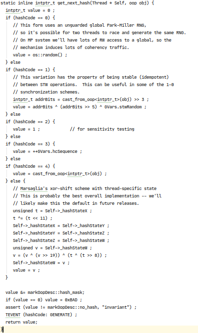

可以看到hashcode有多种返回策略:随机数，自增长序列，关联地址等多种方式。

#### equals方法重写要求
1. 自反性: x.equals(x) == true 永远成立
2. 非空性: x.equals(null) == false 永远成立
3. 对称性: 如果 x.equals(y) == true , 那 y.equals(x)== true  
4. 传递性: 如果 x.equals(y) == true,并且 y.equals(z) == true,那么一定满足x.equals(z) == true
5. 一致性: 如果x.equals(y) == true , 那么只要x和y的值不变,那么x.equals(y) == true　永远成立

#### 为什么重写equals方法一定要重写hashcode方法?
>在普通环境下(不涉及hash表),equals方法和hashcode方法一毛钱关系没有的,
>此时的equals方法是会按照我们的程序去执行的。
>
>但当使用map,set这些散列表时,
>它们会根据对象的hashcode来计算对象在散列表中的位置的。
>试想下,如果2个对象的值相等,但是由于它们是2个对象,hashcode却不相等。
>那么即使放入map,set(map)仍会存在重复数据。

### Java引用类型    

#### 强引用
>一般常用的new方式创建对象,创建的就是强引用. 只要强引用存在且被其他可达的对象引用,
>垃圾回收器就不会回收.        

#### 软引用
>SoftReference , 非必须引用,如果内存足够或正常,就不回收。但是当
>内存不够,快发生OOM的时候就回收掉软引用对象.

#### 弱引用
>WeakReference , 对于弱引用的对象来说,只要垃圾回收器开始回收,
>无论空间是否充足,都回收弱引用的对象.
        
#### 虚引用(幽灵引用)
>和其他几种引用不同,虚引用不会决定对象生命周期,垃圾回收时,无法通过虚引用获取对象
>值.虚引用在任何时候都可能被垃圾回收掉.虚引用必须和引用队列(ReferenceQueue)使用.   
      
#### 软引用,弱引用,虚引用在被GC前会被加入到与其关联的引用队列中.  

### 线程

#### 进程和线程

>进程与线程最主要的区别是它们是操作系统管理资源的不同方式的体现。
准确来说进程与线程属于衍生关系。
进程是操作系统执行程序的一次过程,在这个过程中可能会产生多个线程。比如在使用QQ时，有窗口线程，
>文字发送的线程，语音输入的线程，可能不是很恰当，但是就是这个意思。
在Java中，一个进程产生的多个线程共享这个进程内的堆，metaspace等共享资源，
>每个线程又有自己的程序计数器，虚拟机栈，本地方法栈。
由于系统在线程之间的切换比进程之间的切换更加轻量，所以线程也被成为轻量级进程。

#### 线程的几种状态(见:jdk Thread类源码中的state枚举类)
     NEW,RUNNABLE,BLOCKED,WAITING,TIMED_WAITING,TERMINATED

#### 并发和并行
1. 并发: 多个线程被一个cpu轮流执行，注意，这里并不是规定一个cpu，多个cpu也是可以的，并发主要强调的是cpu有处理多个任务的能力。
2. 并行:多个线程被多个cpu同时执行，这里也并不是规定要多个cpu，一个cpu也是可以的，只要你的cpu能在同一时刻处理多任务，并行强调的是拥有同时处理多任务的能力。

#### sleep方法和wait方法            
1. sleep方法是Thread类的方法，而wait方法是Object类的方法

2. sleep方法会使当前线程让出cpu的调度资源，
从而让其他线程有获得被执行的机会，但是并不会让当前线程释放锁。
而wait方法是让当前线程释放锁并进入wait状态，
不参与获取锁的争夺，从而让其他等待资源的线程有机会获取锁，
只有当其他线程调用notify或notifyAll方法是，
被wait的线程才能重新与其他线程一起争夺资源。
  
#### stop,suspend,resume等方法为什么会被遗弃
* stop:
>>stop方法被弃用很好理解，因为stop方法是强行终止线程的执行，
>>不管线程的run方法是否执行完，资源是否释放完，它都会终止线程的运行，并释放锁。
>>这在设计上就不合理，不说资源控制的问题，
>>当线程正在执行任务的时候，线程突然就被stop了，这根本上就是不被允许的。  

* suspend和resume
>>suspend方法用于阻塞一个线程,但并不释放锁，
>>而resume方法的作用只是为了恢复被suspend的线程。
>>
>>假设A，B线程都争抢同一把锁，A线程成功的获得了锁，
>>然后被suspend阻塞了，却并没有释放锁，它需要其他线程来唤醒，
>>但此时B线程需要获得这把锁才能唤醒A，所以此时就陷入了死锁.
>>
>>这也是它们为什么被弃用的原因。   
          
#### interrupt,interrupted,isInterrupted方法别搞混了
* interrupt:
>>这个方法并不是中断当前线程，而是给当前线程设置一个中断状态。

* isInterrupted:
>>当线程调用interrupt方法后，线程就有了一个中断状态，
>>而使用isInterrupted方法就可以检测线程的中断状态。

* interrupted：
>>这个方法用于清除interrupt方法设置的中断状态。
>>如果一个线程之前调用了interrupt方法设置了中断状态，
>>那么interrupted方法就可以清除这个中断状态。          
 
#### join方法
>join方法的作用是让指定线程加入当线程执行。
>
>假如在main方法里面创建一个线程A执行，并调用A的join方法，
>那么当前线程就是main，指定的A线程就会在main之前执行，
>等A执行完后，才会继续执行main。
>
>join方法的底层是wait方法，
>调用A线程(子线程)的join方法实际上是让main线程wait，
>等A线程执行完后，才能继续执行后面的代码 
            
#### yield方法
>yield属于Thread的静态方法，
>它的作用是让当前线程让出cpu调度资源。
>yield方法其实就和线程的优先级一样，你虽然指定了，
>但是最后的结果不由得你说了算，
>即使调用yield方法，最后仍然可能是这个线程先执行，
>只不过说别的线程可能先执行的机会稍大一些。

---

### 对象在内存中的布局(64位)
**PS:对象在内存中的布局,在32位和64位上的实现也是不同的，以我的
机器为例(64位)**

>对象在内存中由 对象头,实例数据,对齐填充三部分组成。

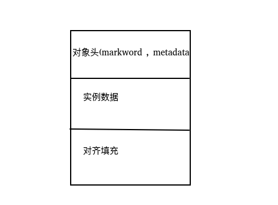
    
#### 对象头
>对象头可以分为2部分数据组成.
>(如果是数组,对象头还会保存数组长度)

可以看到在hotspot虚拟机中的对象头由2部分组成:
mark 和 metadata(klass* , compressed_klass)
(见oop.hpp文件):

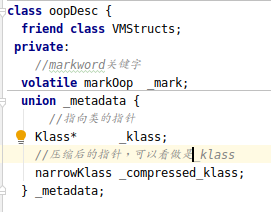

下面是mark/markword的组成(见:markOop.hpp头文件)


对象处于每种状态时的锁标志位都不同(见:markOop.hpp头文件):


#### 1. Mark Word(mark)

| 锁状态    | markword组成      |
| :---:    | :---:    |
|无锁   01    | 由hashcode,分代年龄,偏向锁,锁标志位组成 |
|偏向锁 01    | 由偏向线程的ID,偏向时间戳(epoch),偏向锁,分代年龄,锁标志位组成|
|轻量级锁 00 | 由指向栈中锁的记录和锁标志位组成 |
|膨胀锁 10   |  由指向锁的指针和锁标志位组成   |
| GC 11     | 无数据  |                               
           
#### 2. Klass Pointer /  Compressed Klass
>Klass Pointer是指向对象类型的指针，指针指向对象的类元数据。
>jvm通过klass pointer判断对象属于哪个类。
>
>在64位的jvm实现中，Klass Pointer的长度为64bit(32位系统,
>指针为32bit)，也就意味着,64位系统比32位的系统占用更多内存。
>jvm提供了压缩指针(Compressed Klass)，可以使用-XX:+UseCompressedOops
>来开启指针压缩。
           
#### 实例数据
>实例数据存储着对象在程序中被定义的各个字段的数据,也就是对象的字段的
>数据.
        
#### 对齐填充
>Java对象的小必须是8字节的倍数,像13,15这种非8的倍数的对象的大小,
>不足或多余的部分就要使用对齐填充数据补齐.
>如果Java对象大小正好是8的倍数,那么就无需对齐填充数据

**PS:可以使用openjdk-jol工具查看对象大小**

### synchronized

#### 谈谈 synchronized 关键字
>synchronized关键字是jdk提供的jvm层面的同步锁.
>它解决的是多线程之间访问共享资源的同步性,它保证了
>在被它修饰的方法或代码块只有一个线程执行.
>
>java6之前的synchronized属于重量锁,性能较差.
>它的原理是基于操作系统的Mutex Lock互斥量实现的
>因为java线程是映射到操作系统的线程之上的,所以
>暂停或唤醒线程都需要操作系统帮忙,而操作系统实现
>线程之间的切换需要从用户态转换为内核态,这段
>转换时间消耗较长.
>
>java6之后jvm团队对synchronized做出了非常大的
>优化.

#### synchronized底层原理
先看我编写的一段测试代码:


使用 javap -c -v -l 指令反编译 class文件后的 **字节码指令** 如下


>可以清楚的看到,在进入synchronized的时候，底层字节码编译出来的指令为
>**monitorenter**,在执行完同步代码块后又有一个**monitorexit**指令.

想了解synchronized究竟是如何实现的,可以直接进入openjdk:src/share/vm/runtime 目录,这个目录存放的是hotspot虚拟机在运行时
所需的代码.

>可以直接锁定其中的 objectMonitor.cpp源文件和objectMonitor.hpp头文件.
>看到这2个文件，相信各位同学应该就知道，这个就是synchronized锁对象的monitor，它也是
>一个对象,不过它是一个c++对象(见:objectMonitor.hpp头文件):

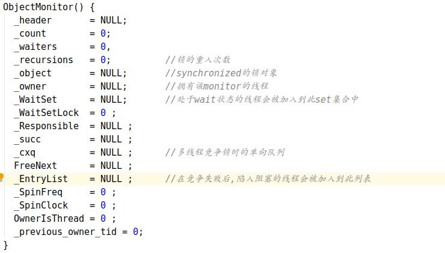 

>其实真正的锁应该是这个monitor,synchronized锁的那个对象起到的只是关联monitor的作用。
>只不过我们身在java层面，无法感知到monitor的作用，所以才称synchronized的锁对象为锁。

以下是monitorenter指令执行过程(见 InterpreterRuntime.cpp):


**PS:本来想真正弄清楚fast_enter(偏向锁的实现),slow_enter(轻量级锁实现)和inflate(膨胀锁实现)
的,无奈看不太懂cpp源码，但是有的地方是可以根据语义来推断的。**

>这里做一个总结吧,这个总结可能不太准确，但大致是这样的:
>每次执行monitorenter指令的时候,是将当前synchronized锁对象
>关联的**monitor**的_recursions加1,
>执行monitorexit指令的时候,将当前object对象关联的**monitor**的_recursions减1,
>当_recursions为0的时候，就说明线程不再持有锁对象。

**PS:如果熟悉AQS原理的同学就知道在AQS内部，
有一个被volatile修饰state变量，
这个state变量就是AQS的核心，
state变量的作用类比到此处就是monitor计数器的作用。**

#### synchronized 使用方法
1. 修饰静态方法: 修饰静态方法是给类加锁,会作用于所有对象,因为静态方法属于类,
而不属于对象,不管有多少个对象,static方法都是共享的.
       
2. 修饰实例方法: 修饰实例方法是给对象加锁,会作用于当前类的实例对象.      

3. 修饰代码块: 修饰代码块,根据代码块给定的对象加锁,线程想要进入代码块,只能获取指定的对象的锁.

#### Synchronized和ReentrantLock的区别

- Synchronized是基于JVM层面的同步机制;而ReentrantLock是基于Java API层面提供的同步机制。

- Synchronized和Reentrantlock都属于可重入锁。

- ReentrantLock提供了比Synchronized更高级的功能:
   - 公平锁
   - 更方便的线程间的通信(Condition)
   - 等待可中断(在线程等待获取锁的时候可以被中断) 

#### lock
>线程不获取到锁不罢休。如果线程获取到了锁，那么线程的锁的计数设置为1，
>如果线程已经持有了该锁，那么锁的计数加1,，否则线程就阻塞

#### tryLock
>尝试获取锁，并立刻返回，如果获取到锁返回true，并设置锁计数为1，并返回true，如果线程已经持有了该锁，
>那么设置锁计数加1并返回true，否则返回false

#### lockInterruptibly
>尝试获取锁，如果获取不到就阻塞，但在阻塞期间响应中断，也就是说在阻塞期间可以被打断，
>不只在阻塞期间可以被打断，而且如果线程在获取锁之前就已经被调用了interrupt方法，那么在阻塞时也会被打断。
>
>与lock相似，但是lockInterruptibly优先响应中断，而不是优先获取锁。


#### 乐观锁
>乐观锁对共享的数据很乐观，
>认为不会发生线程安全的问题，从而不给数据加锁。
>乐观锁适用于读多写少的环境。典型的例子就是mysql的更新使用version控制。CAS也是乐观锁。

#### 悲观锁
>悲观锁对共享的数据很悲观，认为无论什么时候都有可能发生线程安全的问题，
>所以在每次读写数据的时候都会加锁。synchronized就是悲观锁。

#### 独占锁
>锁一次只能被一个线程占有使用,Synchronized和ReetrantLock都是独占锁
    
#### 共享锁
>锁可以被多个线程持有,对于ReentrantReadWriteLock而言,它的读锁是共享锁,
>写锁是独占锁      

#### 公平锁
>指根据线程在队列中的优先级获取锁,比如线程优先加入阻塞队列,那么线程就优先获取锁

#### 非公平锁
>指在获取锁的时候,每个线程都会去争抢,并且都有机会获取到锁,无关线程的优先级    

#### 可重入锁(递归锁)
>一个线程获取到锁后,如果继续遇到被相同锁修饰的资源或方法,那么可以继续获取该锁.
>synchronized便是可重入锁.

#### 偏向锁
>在线程获取偏向锁的时候,
>jvm会判断对象MarkWord里偏向线程的ID是否为当前线程ID,如果是,则说明当前
>对象处于偏向状态。如果不是,则jvm尝试CAS把对象的MarkWord的偏向线程ID设置
>为当前线程ID,如果设置成功,那么对象偏向当前线程，并将当对象的锁标志位改为01。
>如果设置失败，则说明多线程竞争，将撤销偏向锁，升级为轻量级锁。

**偏向锁适用于单线程无锁竞争环境(单线程环境)。**

hotspot偏向锁实现(faster_enter):
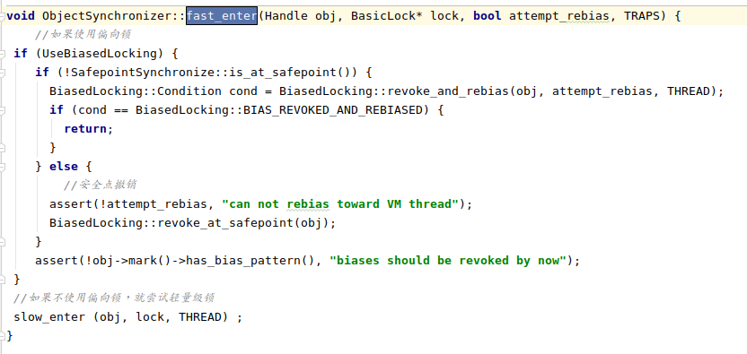
   
#### 轻量级锁
>在线程获取对象锁时，jvm首先会判断对象是否为无锁状态(锁标志位为01),
>如果对象是无锁状态，那么将在线程的栈帧中开辟一块空间用于存储对象的MarkWord，
>然后将对象的MarkWord复制到栈帧空间去，并使用CAS更新对象的MarkWord为指向
>线程栈帧的指针，如果更新成功，那么当前线程获取锁成功，并修改对象的MarkWord标志位
>为 00 。如果更新失败，那么jvm会判断对象的MarkWord是否已经指向线程的栈帧，
>如果已经指向，那么线程直接执行同步代码。否则，说明多个线程竞争，将inflate为
>重量级锁。

**轻量级锁适用于多线程无锁竞争环境(多线程轮流执行)。**

hotspot轻量级锁实现(slow_enter):
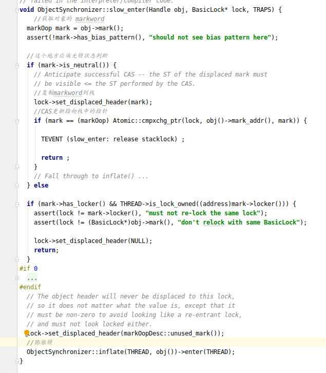   
     
     
#### 自旋锁
>在争夺锁的过程中，线程不会阻塞，而是
>通过不断的CAS来争抢。

#### 自适应自旋锁
>自旋锁意味着线程会不断的消耗cpu资源，短时间还行，
>长时间就意味着而资源的浪费，
>所以自适应自旋锁会有一个自旋的生命周期,过了这个生命周期,
>线程将不再自旋。
>网上有文章说这个生命周期依据前一个线程的自旋时间来决定，但是我暂且没有找到相关
>资料，不敢妄自揣测。

#### 锁消除
>锁消除是当JVM的JIT编译器检测出一些已经加锁的代码，
>不可能存在共享数据竞争的问题，会消除这样的锁.
>锁消除的依据来源于逃逸分析算法。
>如果判断到一段代码，在堆上的数据不会逃逸出去被其他线程访问到，
>那么就把它们当做栈上的数据，为线程私有的，自然无需同步加锁。

````text

    //每次线程进入此方法，创建的都是不同的StringBuffer临时对象,
    //也就是说 StringBuffer 临时对象不会逃出方法t,作用于外部,
    //所以根本不存在线程之间的竞争，那么JIT在编译时就会消除append方法的锁
    public String t(String s1, String s2,String s3)
    {
        return new StringBuffer().append(s1).append(s2)
                    .append(s3).toString();
    }

````       
       
       
#### 锁粗化 
>当虚拟机检测出一系列连续的操作都对同一个连续加锁，
>那么它会把加锁的返回扩大至整个操作的序列的外部，保证只加锁一次。

````text

    public String t()
    { 
        StringBuffer stringBuffer = new StringBuffer();
        for (int i = 0 ; i < 100 ; ++i)
        {
            //append方法执行一百次,难道加100次锁?
           stringBuffer.append(i);
        }
        return stringBuffer.toString();
    }
    
    //t方法经过优化后可能如下:
    public String t()
    { 
        StringBuffer stringBuffer = new StringBuffer();
        //把synchronized方法提升到for循环面，这样就避免了每次
        //append方法的同步
        synchronized (stringBuffer)
        {
           for (int i = 0 ; i < 100 ; ++i)
           {
               stringBuffer.append(i);
           }
        }
        return stringBuffer.toString();
    }

````

#### 死锁
>死锁是指多个进程在执行过程中,循环等待彼此占有的资源而导致程序的无限期的阻塞.     

产生死锁的条件:
1. 互斥条件. 一个资源在一段时间内只能被一个进程所持有.
2. 不可抢占条件.进程所持有的资源只能由进程自己主动释放,其他资源的申请者不能向进程持有者抢夺资源。
3. 占有且申请条件:进程已经持有一个资源后,又申请其他资源,但是其他资源已被其他线程所占有.
4. 循环等待条件:在条件3之上,进程1有进程2需要申请的资源,进程2有进程1需要申请的资源,那么这2个线程
  不停等待彼此持有的资源,又不能释放已拥有的资源,陷入循环等待.

#### 防止死锁
>只要打破死锁产生的4个条件之一就行,但是真正能够被打破的条件只有第4个条件:实现资源的有序分配. 因为其他三个条件都是锁的必要条件。

---    
      
#### volatile
volatile是JVM提供的轻量级的线程同步机制。

1.volatile保证内存的可见性
>可见性是指一个线程的修改对其他线程是可见的。
>jvm的内存模型是: 线程总是从主内存读取变量到工作内存，
>然后在工作内存中进行修改，在修改完后再把数据同步到主内存中。
>如果多个线程同时读取了一个变量到各自的内存中，
>其中一个线程对变量进行了修改，并同步回了主内存，
>但其它线程仍然使用的是原来的旧值，这就造成了数据的不一致。
>解决这个问题的办法就是给变量加上volatile关键字修饰，
>volatile使得线程如果要使用这个变量，那么每次都需要从主内存中读取，保证了变量的可见性。


2.volatile禁止指令重排序
>指令冲排序是编译器和cpu为了程序的高效运行的一种优化手段，
>它只能保证程序执行的结果是正确的，但是无法保证程序指令运行的顺序是否与代码的顺序一致

比如: 

````text
1. int a = 1;
2. int b = 3;
3. int c = a + b;
````
上面的代码在编译后,指令执行的顺序可能有:
1,2,3和2,1,3
这样程序实际执行的顺序可能与代码的顺序不符,但并不会影响程序最终的结果。

3.volatile如何禁止指令重排序的?
volatile通过提供 **内存屏障** 来防止指令重排序.

>java内存模型会在每个volatile写操作前后都会插入store指令，将工作内存中的变量同步回主内存。
>在每个volatile读操作前后都会插入load指令，从主内存中读取变量。

4.volatile不保证原子性
>比如: i++
>
>如果是多线程环境下，一个线程读取到i的值到工作内存，然后对i做出自增操作，然后写回主内存，其它内存才可见。
>可以看到这个过程本身就不是一个原子的.
>所以不能拿volatile来带替synchronized,如果是多线程环境下，仍然需要使用synchronized保证线程同步.
  
### CAS
>CAS: Compare And Swap 比较成功并交换。
>CAS体现的是一种乐观锁的机制。
>CAS涉及到3个元素: 指定的内存地址,期盼值和目标值。
>它将指定内存地址的值与期盼值相比较，如果比较成功就将内存地址的值修改为目标值。
>
#### CAS在JAVA中的底层实现(Atomic原子类实现)  
      
Unsafe类

>CAS在Java中的实现是 juc的atomic包下的Atomicxx原子类。
>而这些Atomic原子类的核心是: <Unsafe>类
>Unsafe类是个final类，它的核心方法都是native的，
>因为Java无法像C/C++一样使用指针来操作内存,
>Unsafe类就解决了这个问题。

>拿incrementAndGet方法来说，
>Unsafe首先调用getAndAddInt方法,
>它会根据当前Atomic的value在内存中地址获取到当前对象的值,
>然后再重复一遍此操作，把之前获得的值与第二遍获得的值进行比较，
>如果成功，就把内存地址的值更新为新值，否则就do while循环.

**并且有个重要的细节就是,Atomic原子类内部的value值都是由volatile修饰的,
这就使得Atomic的值是对其他线程可见的。**
 
#### CAS的缺点
 
* 循环时间开销大
>我在看源码的时候，发现Atomic的CAS操作并没有进行CAS失败的退出处理，
>只是单纯的循环比较并交换，这就让我很担心它的性能问题，
如果长时间不成功，那会是很可怕的一件事请，至少cpu的负荷会很大。
           
* 只能保证一个共享变量的原子操作
>Atomic原子类只能保证一个变量的原子操作，
>如果是多数据的话，还是考虑用互斥锁来实现数据的同步吧
          
* ABA问题
>ABA问题是指如果一个线程进行CAS操作并成功了，
>却不代表这个过程就是没有问题的。

>假设2个线程读取了同一份数据，线程1修改了这个值并把它改回了原值，并同步到主内存中，
>另一个线程准备进行CAS操作,当它发现原值和期盼的值是一样的，那么CAS仍然成功。
           
* 解决ABA问题
>在juc的atomic包中提供了 AtomicStampedReference 类,
>这个类较普通的原子类新增了一个stamp字段，它的作用相当于version，
>每次修改这个引用的值，也都会修改stamp的值，
>当发现stamp的值与期盼的stamp不一样，也会修改失败.
>这就类似于以version实现乐观锁一样。         

---      
         
### ThreadLocal
>ThreadLocal为每个线程都提供了一份相同的变量的副本，
>每个线程都可以修改这个副本，但不用担心与其他线程发生数据冲突，
>实现了线程之间的数据隔离。
>
>ThreadLocal的原理还得从Thread线程类说起，
>每个Thread类内部都有一个ThreadLocalMap，当使用ThreadLocal的get和remove操作的时候，
>就是使用每个线程的ThreadLocalMap的get和remove。

#### ThreadLocal引发的内存泄露:

>在ThreadLocalMap中，key是使用弱引用的ThreadLocal存储的，
>弱引用是只要垃圾回收器开始回收，无论内存是否充足，都会回收掉弱引用对象，如此一来，
>当ThreadLocal被回收掉,那么ThreadLocalMap将可能出现Null Key 的 value。但是也不必太过担心，
>因为设计者已经想到了这点，所以ThreadLocal会自动处理key 为 null的 value.       

---

### AQS (AbstractQueuedSynchronizer)

````text
AQS是Doug Lea大师为JDK编写的一套基于API层面的抽象队列同步器.
AbstractQueuedSynchronizer,抽象队列同步器.
Lock,CountDownLatch等等这些并发工具都是基于AQS来实现的。
由此可以看出Doug Lea大师的功力已经臻至化境
````
   
#### AQS 概述

>AQS的核心思想是如果被请求的资源空闲，那么就将当前请求资源的线程设置为有效的工作线程；
>如果请求的资源被其他线程所占有， 那么就使用CLH线程阻塞队列来提供阻塞线程并唤线程分配资源的机制。
>在CLH队列中，每个请求资源的线程都会被封装成队列中的一个节点。

>在AQS内部有一个int类型的state表示线程同步状态，
>当线程lock获取到锁后，该state计数就加1,unlock就减1，
>这就是为什么解锁要对应加锁的次数。

**AQS主要实现技术为:CLH队列(Craig,Landin and Hagersten)，
自旋CAS，Park(阻塞线程)以及unparkSuccessor(唤醒阻塞队列中的后继线程)。**
     
#### AQS的2种共享资源访问方式
>AQS定义了2种资源共享方式.

* 独占式(Exclusive)
>同一时间只有一个线程可以访问共享资源,也就是独占锁,如:Synchronized,ReentrantLock.
>
>对于独占式锁的实现,在AQS中对应tryAcquire获取锁和tryRelease释放锁. 
         
* 共享式(Share)
> 同一时间允许多个线程同时访问共享资源,也就是共享锁
> CountDownLatch,Semaphore,ReentrantReadWriteLock的ReadLock都是共享锁.
>
>对于共享式锁的实现,在AQS中对应tryAcquireShare获取锁和tryReleaseShare释放锁. 

#### CountDownLatch原理
CountDownLatch允许count个线程阻塞在一个地方，直至所有线程的任务都执行完毕。

>CountDownLatch是共享锁的一种实现,它默认构造AQS的state为count。
>当线程使用countDown方法时,其实使用了tryReleaseShared方法以CAS的操作来减少state,
>直至state为0就代表所有的线程都调用了countDown方法。当调用await方法的时候，如果state不为0，
>就代表仍然有线程没有调用countDown方法，那么就把已经调用过countDown的线程都放入阻塞队列Park,
>并自旋CAS判断state == 0，
>直至最后一个线程调用了countDown，使得state == 0，
>于是阻塞的线程便判断成功，全部往下执行。

#### Semaphore
Semaphore允许一次性最多(不是同时)permits个线程执行任务。

>Semaphore与CountDownLatch一样，也是共享锁的一种实现。
>它默认构造AQS的state为permits。
>当执行任务的线程数量超出permits,那么多余的线程将会被放入阻塞队列Park,并自旋判断state是否大于0，
>只有当state大于0的时候，阻塞的线程才能继续执行,此时先前执行任务的线程继续执行release方法，
>release方法使得state的变量会加1，那么自旋的线程便会判断成功。
>如此，每次只有固定的线程能自旋成功，便限制了执行任务线程的数量。
>
>所以这也是我为什么说它可能不是permits个线程同时执行，
>因为只要state>0,线程就有机会执行.


#### CycliBarrier
CycliBarrier的功能与CountDownLatch相似，但是CountDownLatch的实现是基于AQS的，
而CycliBarrier是基于ReentrantLock(ReentrantLock也属于AQS同步器)和Condition的.

>CountDownLatch虽然可以令线程阻塞，但是CountDownLatch只能await一次就不能使用了，
>而CycliBarrier有Generation代的概念，一个代，就代表CycliBarrier的一个循环，
>这也是CycliBarrier支持重复await的原因。 

#### ReentrantReadWriteLock如何区分读写锁的?

**Sync既有写锁，又有读锁，因此一个state不够用，
所以使用state的高16为表示读锁，低位16表示写锁.**

````java
 ReentrantReadWriteLock部分源码:

 static final int SHARED_SHIFT   = 16;
 static final int SHARED_UNIT    = (1 << SHARED_SHIFT);
 static final int MAX_COUNT      = (1 << SHARED_SHIFT) - 1;
 static final int EXCLUSIVE_MASK = (1 << SHARED_SHIFT) - 1;

 /** Returns the number of shared holds represented in count. */
 static int sharedCount(int c)    { return c >>> SHARED_SHIFT; }
 /** Returns the number of exclusive holds represented in count. */
 static int exclusiveCount(int c) { return c & EXCLUSIVE_MASK; }

````

```text
剩下的就读源码吧。
```

>其实吧，在我读了几遍源码后,才发现，源码真的不难分析。
>但是像我在读SpringBoot的源码时，我就只能分析个大概，
>主要是Jdk的源码之间并没有什么耦合性，你看一个jdk的类，不像
>Spring的源码那样绕来绕去，各种设计模式搞得你头晕。所以我建议阅读源码可以从
>jdk的源码开始，前提是你需要一定的基础才能看得懂。比如我这个版本(11)就发现AQS的部分源码
>与之前版本的源码不同，这个版本的AQS使用了 : VarHandle 这个类来
>设置Node类内部的属性，而之前都是直接使用构造方法来构造Node的,并且AQS使用的是LockSupport
>来阻塞线程的，LockSupport仍然使用的是Unsafe类来进行操作的,这些都属于java与c/c++交互的类,
>所以你如果没有基础，会诧异,jdk还有这种东西呀^-^...              

---

### 线程池的好处
>http连接池，数据库连接池，线程池等都是利用了池化技术。
>如果一个资源需要多次使用并且很昂贵，那么使用new创建的对象或资源，可能会带来较大的消耗。


池化技术的好处在于
1. 方便资源的管理，无需显示的使用new创建。
2. 降低了资源的消耗，在池子里的资源可以重复利用
2. 提供了任务的响应速度，任务可以很快的被分配资源进行处理。

#### 线程池构造参数
````text
 new ThreadPoolExecutor
(int corePoolSize,

 int maximumPoolSize, 

 long keepAliveTime,

 TimeUnit unit,

 BlockingQueue<Runnable> workQueue,

 ThreadFactory threadFactory,

 RejectedExecutionHandler handler)
````

1. corePoolSize: 线程池的核心线程数(常驻线程数),也就是线程池的最小线程数,这部分线程不会被回收.
      
2. maximumPoolSize: 线程池最大线程数,线程池中允许同时执行的最大线程数量
      
3. keepAliveTime: 当线程池中的线程数量超过corePoolSize，但此时没有任务执行，
那么空闲的线程会保持keepAliveTime才会被回收，corePoolSize的线程不会被回收。
      
4. unit: KeepAliveTime的时间单位
  
5. workQueue: 当线程池中的线程达到了corePoolSize的线程数量，
并仍然有新任务，那么新任务就会被放入workQueue。          

6. threadFactory: 创建工作线程的工厂,也就是如何创建线程的,一般采用默认的

7. handler: 拒绝策略，当线程池中的工作线程达到了最大数量，
并且阻塞队列也已经满了，那么拒绝策略会决定如何处理新的任务。ThreadPoolExecutor 提供了四种策略:

   - AbortPolicy(是线程池的默认拒绝策略): 如果使用此拒绝策略，那么将对新的任务抛出RejectedExecutionException异常，来拒绝任务。
   
   - DiscardPolicy: 如果使用此策略，那么会拒绝执行新的任务，但不会抛出异常。

   - DiscardOldestPolicy: 如果使用此策略，那么不会拒绝新的任务，但会抛弃阻塞队列中等待最久的那个线程。     

   - CallerRunsPolicy: 如果使用此策略，不会拒绝新的任务，但会让调用者执行线程。
     也就是说哪个线程发出的任务，哪个线程执行。

 
#### 阿里巴巴开发者手册不建议开发者使用Executors创建线程池
>newFixedThreadPool和newSIngleThreadPoolExecutor都是创建固定线程的线程池,
>尽管它们的线程数是固定的，但是它们的阻塞队列的长度却是Integer.MAX_VALUE的,所以，
>队列的任务很可能过多，导致OOM。

>newCacheThreadPool和newScheduledThreadPool创建出来的线程池的线程数量却是Integer.MAX_VALUE的，
>如果任务数量过多,也很可能发生OOM.

---
---

### java集合

#### HashMap
>HashMap在Jdk8之前使用拉链法实现,jdk8之后使用拉链法+红黑树实现.
>HashMap是线程不安全的,并允许null key 和 null value
>
>HashMap在我当前的版本(11)的默认容量为0.
>在第一次添加元素的时候才初始化容量为 16,
>之后才扩容为原来的2倍.

**HashMap的扩容是根据 threshold决定的,threshold = loadfactory * capacity, 
当 size 大于 threshold 时,扩容。**

**当每个桶的元素数量达到默认的阈值TREEIFY_THRESHOLD(8)时,
那么这个桶的链表将会转为红黑树,
当红黑树节点的数量低于默认的阈值UNTREEIFY_THRSHOLD(6)时，
那么这个桶的红黑树将转为链表**

>HashMap的长度为什么要设计成2的幂？
>这就不得不佩服大师们的设计。
>
>想想看，一个对象的hashcode是很大的，当HashMap的容量仅为16,32时，
>如何根据hashcode来确定key在数组中的下标。
>一个好的办法就是取余: hashcode % length。
>这样就能确保，key的下标是永远不会超过数组的长度的。
>但是想想，除了取余有没有更好的办法，
>当然有:

**hash % length == hash & (length - 1)**

>为什么上面这个性能超高的等式成立，当然是有条件的，

**只有当length为2的幂的时候这样的等式才成立.
这就明白了为什么使用2的幂来定义HashMap的长度。**

#### HashTable
>HashTable就像Vector一样,也是jdk1就存在的很古老的一个类，它是线程安全的，
>实现线程安全的手段是使用synchronized，HashTable的默认容量为16，每次扩容为原来的2倍+1.
>HashTable底层使用拉链法实现.
>
>HashTable不允许null key 和 null value

#### TreeMap

>红黑树实现,不允许null key,允许自然排序Comparable和比较器Comparator 
  
#### ArrayList与LinkedList
1. ArrayList底层使用Object数组实现,LinkedList底层使用双向链表实现.
ArrayList的容量默认为0,只有在第一次执行add操作时才会初始化容量为10。

2. 由于ArrayList采用数组实现,它的容量是固定的,所以当添加新元素的时候,如果超出了数组的容量,
那么此时add操作的时间复杂度将会是O(n-1).相反,LinkedList的add操作只需要改变尾节点的引用就行了,
但是如果需要在指定位置进行add操作的话，那么时间复杂度也是比较高的,为O(n)，
因为需要从头节点或尾节点遍历到需要操作的节点.

3. ArrayList实现了RandomAccess接口，该接口没有具体的规范，只是一个标记，
这代表ArrayList支持快速的随机访问。而LinkedList在这点上就不如ArrayList了。

4. ArrayList在内存空间利用率上肯定是不如LinkedList的，
因为数组是一片固定的连续的内存空间，
一旦分配就无法改变，所以难免会有空间不足或空间使用率很低的情况。
而LinkedList的空间利用率虽然很高，但是它的每个Node可以说也是占用了较大空间的，
因为每个Node需要保存它的前继和后继节点.

**ps: 双向链表与双向循环链表的区别:
双向链表:每个Node都保存了前后2个节点的引用，双向链表的first节点的前一个节点为null,
 last节点的后一个节点为null。**

**双向循环链表: 每个Node都保存了前后2个节点的引用，
双向循环链表的first节点的前一个节点指向last节点，
last节点的最后一个节点指向first节点。**
 
#### ArrayList和Vector
1. ArrayList是线程不安全的，Vector是线程安全的，
但Vector实现线程安全的手段是synchronized。这就好比HashMap与HashTable的区别。

2. Vector默认容量为10，ArrayList默认容量为0，只有在第一次执行
add操作的时候才会初始化容量为10

3. ArrayList扩容为原来的1.5倍，而Vector是当它的扩容增量大于0时，
会扩容为原来的容量+扩容增量，否则扩容为原来的2倍。
 
#### Set
>为啥不单独说HashSet，我目前看到的JDK所有的Set,都是使用Map实现的,
>除了CopyOnWriteArraySet(底层是CopyOnWriteArrayList)。
>
>TreeSet --> TreeMap
>
>LinkedHashSet --> LinkedHashMap
>
>HashSet --> HashMap
>
>ConcurrentSkipListSet --> ConcurrentSkipListMap
>
>Set是如何保证元素不会重复,这个得看各自Map的实现。
>
>拿HashMap来讲，它就是先判断key的hashcode是否相等，然后才使用equals判断
>2个对象是否相等

#### ConcurrentModificationException异常  
 
>ConcurrentModificationException可以从名字看出是并发修改的异常。
>但我要说的是这个异常并不是在修改的时候会抛出的，而是在调用迭代器遍历集合的时候才会抛出，
>而集合类的大部分toString方法，都是使用迭代器遍历的。所以如果多线程修改集合后，
>接着就遍历集合，那么很有可能会抛出ConcurrentModificationException。
>
>在ArrayList，HashMap等非线程安全的集合内部都有一个modCount变量，
>这个变量是在集合被修改时(删除，新增)，都会被修改，如果是多线程对同一个集合做出修改操作，
>就可能会造成modCount与实际的操作次数不符，那么最终在调用集合的迭代方法时，
>modCount与预期expectedModeCount比较，expectedModCount是在迭代器初始化时使用modCount赋值的，
>如果发现modCount与expectedModeCount不一致，就说明在使用迭代器遍历集合期间，
>有其他线程对集合进行了修改,所以就会抛出ConcurrentModificationException异常。

#### 线程安全的 List
1. 使用集合工具类Collections的 synchronizedList把普通的List转为线程安全的List.(不推荐)
2. 使用Vector.(不推荐)
3. 使用CopyOnWriteArrayList,推荐使用此种方法，因为以上2种全部都是单纯的Synchronized加锁.
 
#### CopyOnWriteArrayList
>CopyOnWriteArrayList是线程安全的ArrayList，
>可以被称为 写时复制的ArrayList，它底层仍然使用数组实现，
>但是它的修改操作(增删改)采用synchronized关键字保证并发的安全性，
>然后在进行修改的时候复制原来的数组到一个新副本，
>对新副本进行修改，修改完后再设置原数组。这样就不会让写操作影响读操作了。 
>
>但是CopyOnWriteArrayList不容忽视的缺点就是修改操作比较消耗内存空间，所以它适用于读多写少的环境。
  
#### 线程安全的Set
1. 使用集合工具类的Collections的synchronizedSet把普通的set转为线程安全的set(不推荐)
2. 使用CopyOnWriteArraySet,此set适用于读多写少的情况，它的底层采用CopyOnWriteArrayList实现.
3. 使用ConcurrentSkipListSet，底层采用ConcurrentSkipListMap实现
  
#### 线程安全的Map
1. 使用集合工具类Collections的synchronizedMap把普通map转为线程安全的map(不推荐)
2. HashTable(不推荐)
3. 使用ConcurrentHashMap(常用)
4. ConcurrentSkipListMap(跳表map)

#### ConcurrentHashMap
>ConcurrentHashMap使用数组+链表/红黑树实现,其扩容等机制与HashMap一样,
>但是控制并发的方法改为了CAS+synchronized
>synchronized锁的只是链表的首节点或红黑树的首节点,

**PS:我承认我只看了常用的put,get,remove等核心方法的源码.
整个ConcurrentHashMap的实现用"复杂"来形容一点也不为过,
你只要想到它内部有52个内部类就知道有多复杂了,但如果不考虑并发CAS这部分，
ConcurrentHashMap和普通的HashMap的差别是不大的。**

#### ConcurrentSkipListMap
>ConcurrentSkipListMap是基于跳表这种数据结构实现的。
>跳表比较特殊，它由多个层次的链表组成，每层链表又有多个索引节点连接，
>每层链表的元素也都是有序的。处于上层索引的链表都是下层链表的子集。
>跳表与普通链表相比查找元素的效率更高。


---
---

### Java IO

**IO图源:
[简书](https://www.jianshu.com/p/85e931636f27) (如有侵权,请联系俺,俺会立刻删除)**

#### 操作系统的用户态与内核态
unix与linux的体系架构：分为用户态与内核态.

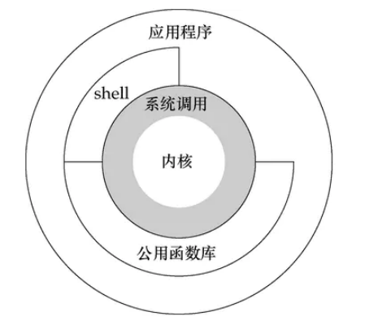


```text
个人理解:用户态与内核态是操作系统对执行权限进行分级的不同的运行模式。
```

#### 操作系统的内核：

````text
操作系统的内核是操作系统的核心部分。它负责管理系统的进程，设备(硬件)驱动程序，文件，内存，网络等部分。
````

* 内核态(核心态,特权态)
>内核态是操作系统内核运行的模式.内核态控制计算机的硬件资源,并为上层应用程序提供执行环境。

* 用户态
>用户态是应用程序的活动空间,也是应用程序运行的模式。应用程序的执行必须依托于内核态,
因此用户态的态的操作权限比内核态是要低的，如磁盘，cpu等，访问操作都是受限的。

* 系统调用
>内核为上层应用程序提供能够访问到内核态的资源的接口。

#### 用户态切换到内核态的几种方式
* 系统调用
>系统调用是用户态主动要求切换到内核态的一种方式，用户态通过操作系统调用内核为上层应用
>程序开放的接口来执行程序。

* 异常
>当cpu在执行用户态的应用程序时，发生了某些不可知的异常。于是当前用户态的应用进程
>切换到处理此异常的内核的程序中去。

* 外围设备的中断
>当外围设备完成用户请求后，会向cpu发出相应的中断信号，这时cpu会暂停执行下一条
>即将要执行的指令，转而去执行与中断信号对应的应用程序，如果先前执行的指令是用户态
>下的程序，那么这个转换过程也是用户态到内核台的转换。比如硬盘读写完成，系统会切换到
>硬盘读写的中断处理程序中执行后续操作。


#### 阻塞和非阻塞
1. 阻塞: 一个线程调用一个方法计算 1 - 100 的和，如果该方法没有返回，那么调用的线程就一直等待该方法返回，
不继续往下执行。

2. 非阻塞: 一个线程调用一个方法计算 1 - 100的和，如果该方法没有返回，调用者线程也无需一直等待该方法返回，
可以执行其他任务，但是线程仍然需要不断检查方法是否返回。

**结论: 阻塞与非阻塞针对调用者的立场而言。**

#### 同步与异步
1. 同步: 一个线程调用一个方法计算 1 - 100 的和，如果方法没有计算完，就不返回。
2. 异步: 一个线程调用一个方法计算 1 - 100 的和，该方法立刻返回，但是由于方法没有返回结果，所以就需要被调用的这个
方法来通知调用线程 1 - 100的结果，或者线程在调用方法的时候指定一个回调函数来告诉被调用的方法执行完后就执行回调函数。

**结论:同步和异步是针对被调用方的立场而言的。**

### Linux IO模型

1. 阻塞IO
2. 非阻塞IO
3. 多路复用IO
4. 信号驱动IO
5. 异步IO

#### 阻塞IO
>阻塞IO是很常见的一种IO模型。
>在这种模型中，用户态的应用程序会执行一个操作系统的调用，
>检查内核的数据是否准备好。如果内核的数据已经准备好，
>就把数据复制到用户应用进程。如果内核没有准备好数据，
>那么用户应用进程(线程)就阻塞，直到内核准备好数据并把数据从
>内核复制到用户应用进程，最后应用程序再处理数据。

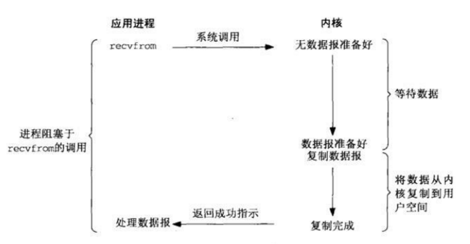

阻塞IO是同步阻塞的

1.阻塞IO的同步体现在:
>内核只有准备好数据并把数据复制到用户应用进程才会返回。

2.阻塞IO的阻塞体现在:
>用户应用进程等待内核准备数据和把数据从用户态拷贝到
>内核态的这2段时间。当然,如果是本地磁盘IO,内核准备数据的时间可能会很短。
>但网络IO就不一样了，因为服务端不知道客户端何时发送数据，
>内核就仍需要等待socket数据，时间可能会很长。

阻塞IO的优点是对于数据是能够保证无延时的，
因为应用程序进程会一直阻塞直到IO完成。

但应用程序的阻塞就意味着应用程序进程无法执行其他任务，
这会大大降低程序性能。一个不太可行的办法是为每个客户端socket都分配一个线程，
这样就会提升server处理请求的能力。不过操作系统的线程资源是有限的，
如果请求过多，可能造成线程资源耗尽，系统卡死。。。


#### 非阻塞IO(网络IO模型)
>在非阻塞IO模型中，用户态的应用程序也会执行一个操作系统的调用，
>检查内核的数据是否准备完成。但内核会立刻返回结果。
>如果内核没有准备好数据，那么用户应用进程不会一直阻塞等待内核准备数据，
>而是可以执行其他任务,但仍需要不断的向内核发起系统调用，检测数据是否准备好，
>这个过程就叫轮询。轮询直到内核准备好数据，然后内核把数据拷贝到用户应用进程，
>再进行数据处理。


>非阻塞IO的非阻塞体现在用户应用进程不用阻塞在对内核的系统调用上

非阻塞IO的优点在于用户应用进程在轮询阶段可以执行其它任务。
但这也是它的缺点，轮询就代表着用户应用进程不是时刻都会发起系统调用。
可能数据准备好了，而用户应用进程可能等待其它任务执行完毕才会发起系统调用，
这就意味着数据的延时获取。

#### 多路复用IO(网络IO模型)
>在多路复用IO模型中,用户应用进程会调用操作系统的select/poll/epoll函数,
>它会使内核同步的轮询指定的socket，
>(在NIO,socket就是注册到Selector上的SocketChannel,可以允许多个)
>直至监听的socket有数据可读或可写，select/poll/epoll函数才会返回。
>用户应用进程也会阻塞的等待select/poll/epoll函数返回。
>当select/poll/epoll函数返回后，即某个socket有数据了，用户应用进程就会
>发起系统调用，将数据从内核态拷贝到用户应用进程内，然后进行数据处理。

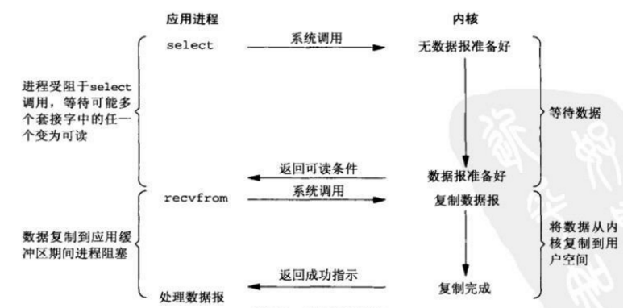


多路复用IO模型是同步阻塞的

1.多路复用IO模型的同步体现在
>select函数只有监听到某个socket有数据才会返回。

2.多路复用IO模型的阻塞体现在
>用户应用进程会阻塞在对select函数上的调用上。

多路复用IO的优点在于内核可以处理多个socket，
相当于一个用户进程(线程)就可以处理多个socket连接，
这样不仅降低了系统的开销，并且对于需要高并发的应用是非常有利的。
而非阻塞IO和阻塞IO的一个用户应用进程只能处理一个socket，
要想处理多socket，只能新开进程或线程，但这样很消耗系统资源。

**PS: 
在多路复用IO模型中, socket一般应该为非阻塞的，
这就是Java中NIO被称为非阻塞IO的原因。
具体原因见 [知乎讨论](https://www.zhihu.com/question/37271342)**


**PS:
select/poll/epoll函数是多路复用IO模型的基础，所以如果想
深入了解多路复用IO模型，就需要了解这3个函数以及它们的优缺点。**

#### 信号驱动IO(网络IO模型)

>在信号驱动IO模型中，用户应用进程发起sigaction系统调用,内核收到并立即返回。
>用户应用进程可以继续执行其他任务，不会阻塞。当内核准备好数据后向用户应用进程
>发送SIGIO信号，应用进程收到信号后，发起系统调用，
>将数据从内核拷贝到用户进程，然后进行数据处理。

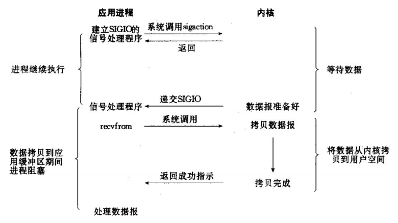

个人感觉在内核收到信号就立刻返回这一点很像异步IO的方式了，不过
与异步IO仍有很大差别。

#### 异步IO
>在异步IO模型中，用户进程发起aio_read系统调用，无论内核的数据是否准备好，
>都会立即返回。用户应用进程不会阻塞,可以继续执行其他任务。当内核准备好数据,
>会直接把数据复制到用户应用进程。最后内核会通知用户应用进程IO完成。


异步IO的异步体现在:
>内核不用等待数据准备好就立刻返回，
>所以内核肯定需要在IO完成后通知用户应用进程。


```text
弄清楚了阻塞与非阻塞，同步与异步和上面5种IO模型，相信再看
Java中的IO模型，也只是换汤不换药。
```

* BIO 阻塞IO
* NIO 多路复用IO
* AIO 异步IO

本来打算写Java中的IO模型的，发现上面几乎讲完了(剩API使用吧)，
没啥要写的，所以暂时就这样吧。

**PS:
当然，我此处写的IO模型均是借鉴于网上的资料，如有错误，
请各位同学指出。**

---
---

### JVM(参考:《深入理解Java虚拟机》(周志明))


#### JVM运行时内存分区
>以HotSpot为例:

* JDK8之前:
>线程私有的部分有:程序计数器(PC寄存器),JAVA虚拟机栈,本地方法栈(native)。

>线程共享部分有: GC堆,永久代(是方法区的一种实现)。

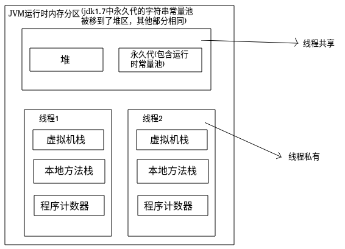

* JDK8之后:
>线程私有的部分不变, 线程共享部分的永久代改为了元空间(MetaSpace)
>(永久代和元空间都是方法区的实现),运行时常量池也移动到了 heap空间
    
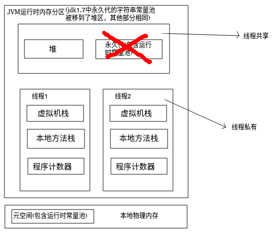     
    
#### 程序计数器
>程序计数器是一块较小的内存空间，
>它的作用是作为当前线程执行的字节码的行号指示器。
>当字节码解释器工作时，通过改变行号计数器的值来选取下一条要执行的字节码指令。
>分支，循环，跳转，异常处理，线程恢复等功能都需要依赖程序计数器完成。

>程序计数器是属于线程私有的部分。
>当cpu在多个线程之间切换执行时，需要记录下当前线程执行的字节码的位置，
>以便下次切换回当前线程时，能够继续执行字节码指令，
>所以每个线程都需要有自己的程序计数器。

#### 程序计数器的特点
1. 如果当前线程执行的是java方法，那么程序计数器记录的是字节码指令的地址。
2. 如果当前线程执行的native方法，那么程序计数器记录的值为空(undefined)。
3. 程序计数器这部分内存区域是JVM中唯一不会出现OOM错误的区域
4. 程序计数器的生命周期与线程相同,即程序计数器随着线程创建而创建，
   随着线程的销毁而销毁。
   
```text
使用 javap -c -v -l 反编译class文件后的代码如下,
红框里的就是字节码的偏移地址:
```

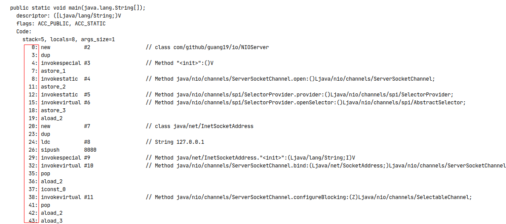
      
#### Java虚拟机栈
>Java虚拟机栈与程序计数器一样，
>都是线程私有的部分，生命周期也跟线程一样。

**Java虚拟机栈描述的是Java方法运行时的内存模型，它由一个一个的栈帧组成。**

#### 栈帧

>栈帧是用于支持Java方法运行时的数据结构。
>栈帧包含了局部变量表，操作数栈，动态连接，方法出口等信息。
>每个方法执行时，都会在java虚拟机栈中创建一个栈帧。对方法的调用和返回，
>就对应着栈帧的入栈和出栈的过程。

Java虚拟机栈:
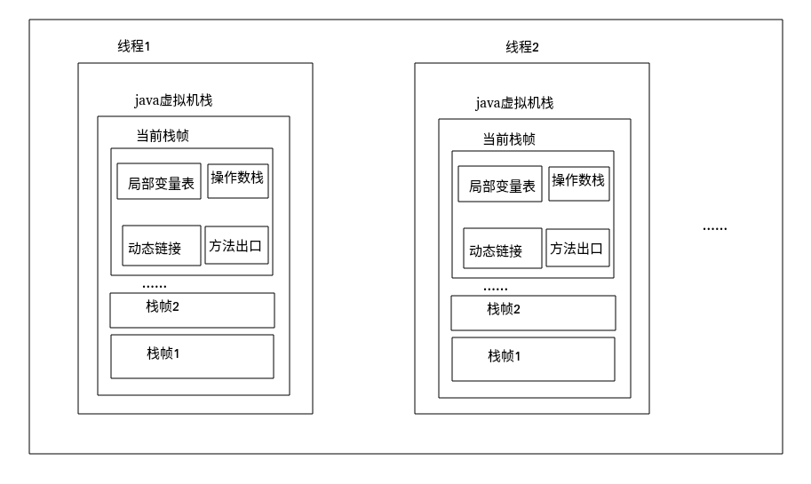
    
           
#### 局部变量表
>局部变量表用于存储方法参数和方法内定义的局部变量。
>局部变量表存放了各种已知的数据类型的变量。
>一个局部变量的类型可以是基本数据类型
>(int,short,float,double,boolean,long,byte,char)或引用类型(reference)。
>在Java代码被编译成class字节码后，方法Code属性的locals就确定了方法的局部变量表的大小。
>局部变量表以slot为最小单位，一个slot代表4个字节，也就是32位长度的大小。

  
#### 操作数栈
>操作数栈是一个后进先出(LIFO)的数据结构。
>它存储的是方法在进行数据运算时的元素。
>和局部变量表一样，操作数栈的每个元素的类型也可以是基本数据类型和引用类型。
>操作数栈的深度不会超过 Code属性的stack值。

使用java -c -v -l 反编译class文件后可以得到的字节码指令如下:

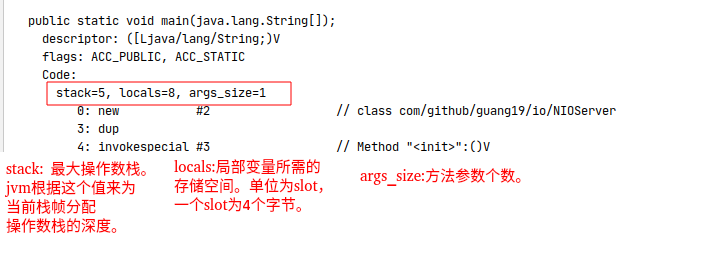

#### 动态连接
````text
了解动态连接首先需要了解符号引用和直接引用
````

* 符号引用
>符号引用存于Class文件常量池。
>分为类的全限定名，方法名和描述符，字段名和描述符。

* 直接引用
>指向目标的指针，可以简单理解为目标的内存地址(如指向类的字段的内存地址)。

Class文件常量池如下(javap -c -v -l 反编译class文件后的字节码):


>在虚拟机栈中，每个栈帧都包含了一个该栈帧所属方法的符号引用，
>持有这个符号引用的目的是为了支持方法调用过程中的动态连接。
>这些符号引用有的一部分会在JVM类解析阶段就会转为直接引用，这部分转换成为静态解析。
>还有一部分会在运行时转为直接引用，这部分称为动态连接。

#### 方法出口
>当方法执行时，有2种方式可以退出该方法。

* 正常退出
>当方法执行时，执行到return指令，该方法就会正常退出。
一般来说，方法正常退出时，调用者的程序计数器的值可以作为方法返回的地址，
>栈帧中可能会保存这个计数器的值。

* 异常退出
>在方法执行过程中遇到了异常，并且方法内部没有处理这个异常，就会导致方法退出。
>方法异常退出时，返回地址需要通过异常处理器表来确定的，栈帧中不会保存这部分值。

**无论何种退出方式，在方法退出后，都需要回到方法被调用的位置，
程序才能继续执行。**

#### 本地方法栈
>本地方法栈与虚拟机栈的作用是相似的，
>不过虚拟机栈是为执行Java方法提供服务的，
>本地方法栈视为执行native方法提供服务的。
>在本地方法执行的时候，也会在本地方法栈中创建栈帧，
>用于存放该本地方法的局部变量表，操作数栈，动态连接和方法返回地址等信息。
   
#### 堆

>堆是JVM中内存占用最大的一块区域，它是所有线程共享的一块区域。
>堆的作用是为对象分配内存并存储和回收它们。
>堆是垃圾回收的主要区域，所以堆区也被成为GC堆。
>
>堆区可以划分为 新生代(Young Generation),老年代(Old Generation)和
>永久代(Permanent Generation),但永久代已被元空间代替,
>元空间存储的是类的元信息，几乎不可能发生GC。

>新生代再细分可以分为: Eden空间，From Survivor空间和To Survivor空间。
>
>缺省状态下新生代占堆区的 1/3,老年代占堆区的2/3，
>eden空间占新生代的80%,2个Survivor空间栈新生代的20%,
>FromSurvivor和ToSurvivor的空间占比为1:1。
>
>(通过-XX:NewRatio参数可以调整新生代和老年代的空间占比)
>(通过-XX:SurvivorRatio参数可以调整eden和survivor的空间占比)
>
>发生在新生代的GC叫做Young GC或Minor GC,
>发生在老年代的GC叫做Old GC或Major GC


堆:
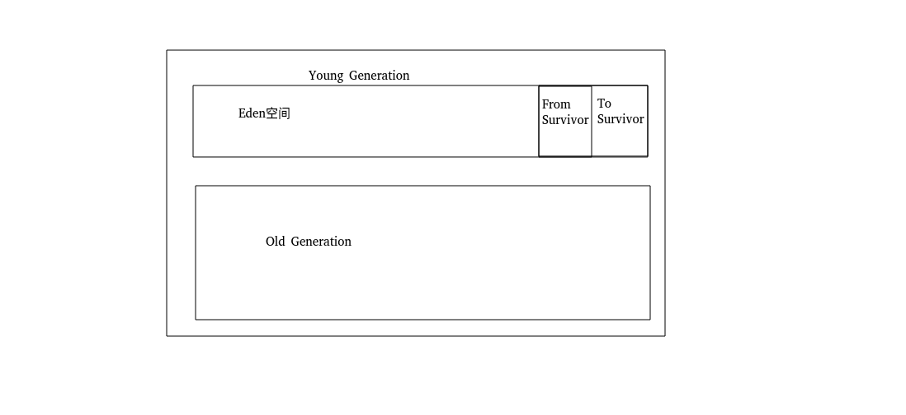

**PS:
FromSurvivor和ToSurvivor这两块内存空间并不是固定的，
在进行GC的时候，这两块内存会轮流替换使用。这部分内容参考GC部分。**


**PS:
有的文章说 Full GC与Major GC一样是属于对老年代的GC，
也有的文章说 Full GC 是对整个堆区的GC，所以这点需要各位同学自行
分辨Full GC语义。
见: [知乎讨论](https://www.zhihu.com/question/41922036)**


#### 方法区

>方法区在JVM规范里是各个线程共享的一部分区域，
>它用于存储已被jvm加载的类的元信息，运行时常量池等数据。

>HotSpot虚拟机对于方法区的实现在jdk8之前为永久代，在jdk8之后，
>HotSpot移除了永久代，新增了元空间。
>
>元空间使用的是本地内存，所以元空间仅受本地物理内存的限制。
>元空间存储着已被加载的类的方法描述，字段描述，运行时常量池等信息。

**字符串常量池在jdk7已经从永久代转移到了堆内存之中。**

**方法区在逻辑上是属于堆区的。
在jdk8之前，堆区在GC时会回收永久代。
但jdk8之后的元空间归属于物理内存，
存储的都是常量，几乎不可能发生GC。**

**无论是永久代还是元空间，都有可能发生OOM。**</u>

### JavaVirtualMachineError
  
#### StackOverflowError
当前线程执行或请求的栈的大小超过了Java
虚拟机栈的最大空间(比如递归嵌套调用太深),就可能出现StackOverflowError错误
           
#### OutOfMemoryError
             
* java heap space 
>当需要为对象分配内存时，堆空间占用已经达到最大值，
>无法继续为对象分配内存，可能会出现OOM: java heap space错误。 
   
* GC overhead limit exceed
>垃圾回收器花费了很长时间GC,但是GC回收的内存非常少,
>就可能抛出OOM:GC overhead limit exceed 错误。
>
>但是这点在我的机器上测试不出来,可能与jdk版本或gc收集器或Xmx分配内存的大小有关,
>一直抛出的是java heap space

* Direct buffer memory
>当程序分配了超额的本地物理内存(native memory/ direct buffer)，
>minor gc(young gc)并不会回收这部分内存，
>只有 full gc才会回收直接内存，如果不发生full  gc，
>但直接内存却被使用完了，那么可能会发生 OOM: Direct buffer memory。
     
* unable to create new native thread 
>操作系统的线程资源是有限的，
>如果程序创建的线程资源太多(无需超过平台限制的线程资源上限)，
>就可能发生 OOM: unable to create new native thread 错误。 
   
* Metaspace
>当加载到元空间中的类的信息太多，就有可能导致 OOM : Metaspace。

**PS:
使用cglib的库，可以动态生成class，
所以可以使用cglib测试此错误(Metaspace)**

---

### 简单了解类文件结构

Class文件结构如下:

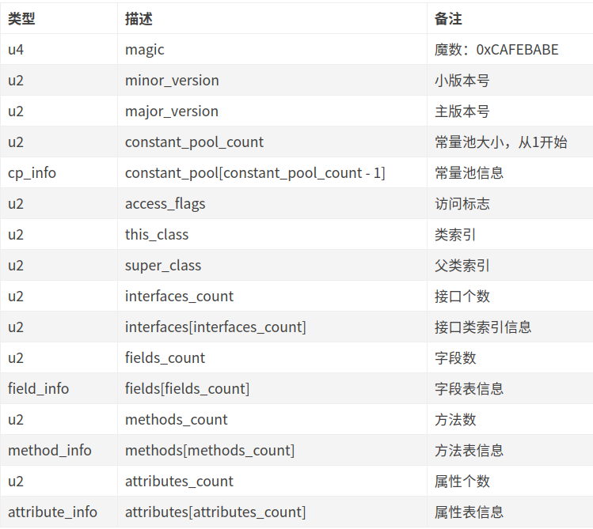

使用vim -b filename 以二进制模式编辑class文件，
然后输入 **:%!xxd** 即可查看十六进制的Class文件,如下:

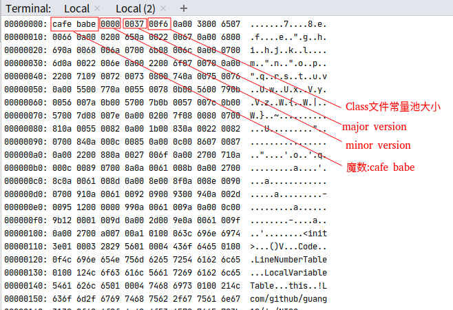

当然，最直观的方法是对 class 文件使用 javap -c -v -l命令进行详细查看。

---

### 类的生命周期
>当java源代码文件被javac编译成class文件后，并不能直接运行，
>而是需要将class文件加载到内存，并经过连接和初始化这几个阶段
>后才能使用。在使用完类后，需要将类卸载掉。


#### 类加载过程

类加载过程需要经过3个阶段:

1. 加载
2. 连接
3. 初始化

其中连接又可分为3个阶段: 验证 ， 准备 ， 解析。

#### 加载
>在加载阶段，类加载器将类的class文件的二进制数据读取到内存，并保存到方法区，
>并在堆区生成该类的Class对象。
>
>通常有多种方式可以获取类的二进制数据:

* 通过javac编译器编译java源文件，读取在本地磁盘上生成的class文件。
* 从Jar，ZIP等归档文件中读取class文件。
* 通过网络读取类的字节流。
* 通过动态生成字节码的技术(如使用动态代理，cglib)来生成class。

**PS:数组由数组元素的类型的类加载器在java程序运行时加载，这是ClassLoader类的部分注释:**


**见: [测试](https://github.com/guang19/framework-learning/blob/master/jdk_jvm_juc-learning/src/main/java/com/github/guang19/jvm/classloader/ArrayClassLoaderTest.java)**


#### 连接

1.验证
>验证阶段是为了确保类的字节流符合虚拟机规范，并且不会对虚拟机造成恶意损害。
>JVM会对字节流进行如下验证:
``
* 文件格式验证:会验证class文件是否符合虚拟机规范，如是否以0×CAFEBABE开头，
主次版本号是否在虚拟机规定范围类，常量池中的类型是否有JVM不支持的类型。

* 元数据验证: 会对类的元信息进行语义分析，确保符合Java语法规范。

* 字节码验证: 通过分析数据流和控制流，确保类的方法体的程序语义是合法的，
符合逻辑的。

* 符号引用验证: 确保常量池中的符号引用能在解析阶段正常解析。

2.准备
>准备阶段会为类的静态变量初始化零值，如(0,0L,null,false).

3.解析
>解析阶段会将常量池中的符号引用转为直接引用。
>
>符号引用包括类的全限定名，方法名和描述符，字段名和描述符。  
>
>直接引用是指向目标的指针，可以简单理解为目标的内存地址。

#### **初始化**
>初始化阶段是类加载过程的最后一个阶段。在这个阶段，

**只有主动使用类才会初始化类，总共有8种情况会涉及到主动使用类。**

1. 当jvm执行new指令时会初始化类。即当程序创建一个类的实例对象。
2. 当jvm执行getstatic指令时会初始化类。即程序访问类的静态变量(不是静态常量，常量归属于运行时常量池)。
3. 当jvm执行putstatic指令时会初始化类。即程序给类的静态变量赋值。
4. 当jvm执行invokestatic指令时会初始化类。即程序调用类的静态方法。
5. 当使用反射主动调用这个类时,也会初始化类,如Class.forname("..."),newInstance()等等。
6. 当初始化一个子类的时候，会先初始化这个子类的所有父类，然后才会初始化这个子类。
7. 当一个类是启动类时，即这个类拥有main方法，那么jvm会首先初始化这个类。
8. MethodHandle和VarHandle可以看作是轻量级的反射调用机制，而要想使用这2个调用，
就必须先使用findStatic/findStaticVarHandle来初始化要调用的类。

**PS:见:[测试](https://github.com/guang19/framework-learning/blob/master/jdk_jvm_juc-learning/src/main/java/com/github/guang19/jvm/classloader/LoadClass.java)**


#### 使用
在类被初始化完成后，就可以使用类了。

#### 类的卸载
类被卸载(Class对象被GC掉)需要满足3个条件:

1. 该类的实例对象都已被GC，也就是说堆中不存在该类的实例对象。
2. 该类没有在其它任何地方被使用。
3. 加载该类的类加载器实例已被GC。

>在JVM的生命周期中，被JVM自带的类加载器所加载的类是不会被
>卸载的。而被我们自定义的类加载器所加载的类是可能会被卸载的。
>
>其实只要想通一点就好了，jdk自带的BootstrapClassLoader，
>PlatformClassLoader和AppClassLoader负责加载jdk提供的
>类，它们(类加载器)的实例肯定不会被回收，其中BootstrapClassLoader在java中
>更是不能被获取到。而我们自定义的类加载器的实例是可以被GC掉的，
>所以被我们自定义类加载器加载的类是可以被GC掉的。


**PS:使用-XX:+TraceClassUnloading 或 -Xlog:class+unload=info可以打印类卸载的信息。**

#### Java中类加载器有多少个
1. BootstrapClassLoader(用于加载Java基础核心类库。由c/c++编写，Java获取不到)。
2. PlatformClassLoader
(jdk9之后才有此类加载器，jdk8之前是扩展加载器ExtensionClassLoader
。PlatformClassLoader加载平台相关的模块，ExtensionClassLoader加载jdk扩展的模块)。
3. AppClassLoader。(应用程序类加载器，负责加载我们程序的classpath下的jar和类)。
4. 自定义类加载器。

#### 类加载器的命名空间
>每个类加载器实例都有自己的命名空间，命名空间由该加载器及其所有父加载器加载的所有的类组成。
>在同一个命名空间中，不会出现全限定名(包括包名)相同的2个类
>在不同的命名空间中，可能会出现全限定名(包括包名)相同的2个类

**PS:见:[测试](https://github.com/guang19/framework-learning/blob/master/jdk_jvm_juc-learning/src/main/java/com/github/guang19/jvm/classloader/MyClassLoader.java)**

#### 双亲委派机制

#### 为什么需要双亲委派机制?
>双亲委派机制是为了防止类的重复加载，避免核心API遭到恶意破坏。
>如Object类，它由BootstrapClassLoader在JVM启动时加载。
>如果没有双亲委派机制，那么Object类就可以被重写，其带来的
>后果将无法想象。

#### 双亲委派机制的实现原理?
每个类都有其对应的类加载器。
>双亲委派机制是指在加载一个类的时候，
>JVM会判断这个类是否已经被其类加载器加载过了。
>如果已经加载过了，那么直接返回这个类。
>如果没有加载，就使用这个类对应的加载器的父类加载器判断，
>一层一层的往上判断，最终可能会由BootstrapClassLoader判断。
>如果BootstrapClassLoader判断都没有加载这个类,
>那么就由BootstrapClassLoader尝试加载。
>如果BootstrapClassLoader加载失败了，
>就由BootstrapClassLoader的子类加载器们加载。

**在jdk9之后，由于模块化的到来，双亲委派机制也变化了一点:
如果类没有被加载，那么会根据类名找到这个类的模块。
如果找到了这个类的模块，
就由这个类的模块加载，否则仍然使用父类加载器加载。**

可以看出:在加载一个类时，是由下自上判断类是否被加载的。如果类没有被加载，
就由上自下尝试加载类。

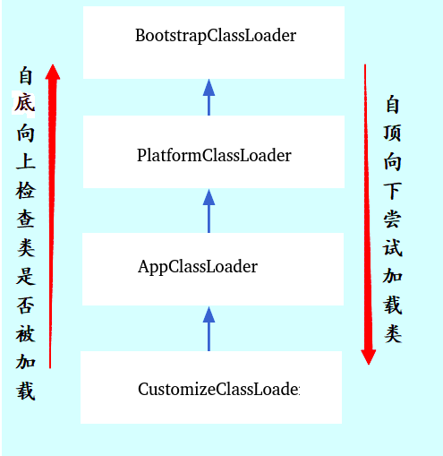

---

### JVM常量池

Jvm常量池分为:

1. Class常量池(静态常量池)
2. 运行时常量池
3. 字符串常量池(全局常量池)
4. 包装类型缓存池

#### Class常量池(静态常量池)
>当Java源文件被编译后，就会生成Class字节码文件。
>Class常量池就存在于Class文件中(Class文件的Constant Pool中)。
>
>Class文件常量池主要存放两大常量:
>字面量和符号引用。

1. 字面量
字面量分为文本字符串(如: "abc",1等)和用final修饰的成员变量(实例变量和静态变量)

2. 符号引用
符号引用包括三种：类的全限定名，方法名和描述符，字段名和描述符。


#### 运行时常量池
>运行是常量池是在类加载阶段，将class二进制数据加载到内存，
>并将数据保存到方法区,其中class文件中的常量池将保存到
>运行时常量池(数据都在方法区，常量池肯定也在方法区)。
>然后在解析阶段会将常量池中的符号引用替换成直接引用。
>也就是说一个Class文件常量池对应一个运行时常量池。

#### 字符串常量池(全局常量池)
>字符串常量池在jdk7之前都是存于永久代(永久代)之中,jdk7以后存于
>堆区之中。

#### 包装类型缓存池
>包装类缓存池并不是所有的包装类都有，并且缓存池缓存的是一定范围内的
>数据。
>拥有包装类型缓存池的类有:Integer,Byte,Character,Long,Short，
>而Float，Double，Boolean都不具有缓存池。

**包装类的缓存池缓存的范围基本都为: -128 - 127之间，
Character的缓存范围为 0 - 127。**

---
    
### GC    
    
#### 判断对象存活的方法
>在垃圾回收器对堆
>内存回收前，需要判断对象是否存活。

*  引用计数算法:
>给每个对象添加一个引用计数器,每当对象被引用,
>对象的引用计数器就加1,当引用失效时,引用计数器就减1,
>直到引用计数器为0,就代表对象不再被引用。

**引用计数的主要缺陷是很难解决循环引用的问题:
也就是当2个对象互相引用的时候,除了彼此,
没有其他地方引用这2个对象,那么他们的引用计数都为1,就无法被回收。**

* 可达性算法:
>通过GC ROOT的对象节点往下搜索,
>节点走过的路径被称为引用链,如果一个对象不处于任何引用链,
>那么此对象是不可达的。
          
#### 什么是GC Root ?
>上面说通过GC Root对象搜索引用链,那么GC Root对象是什么对象,
>或者说什么样的对象是GC Root对象.
>可以作为GC Root对象的有: 

1. 虚拟机栈和本地方法栈区(native)中的引用对象(common object)
2. 方法区中类的静态属性引用的对象(static)
3. 方法区中的常量引用的对象(final)   

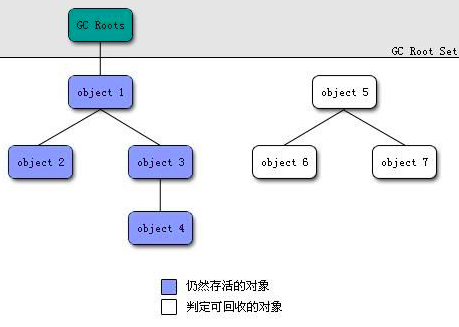      
        
### 垃圾回收算法
常见的垃圾回收算法主要有以下4种:
1. 复制算法
2. 标记-清除算法
3. 标记-整理算法
4. 分代收集算法

#### 复制算法(Copying)
>将堆内存分为2块大小相等的内存空间，
>每次只使用其中的一块内存，另一块则空闲。
>当其中一块内存使用完后，
>就将仍然存活的对象复制到另一块空闲内存空间，再清理已使用的内存。

**复制算法的优点是不会产生连续的内存碎片，速度也很高效。
但是缺点更明显:每次只使用内存的一半，就代表可使用的内存减少了1/2，
代价很高昂。**

>复制算法一般用于新生代。因为新生代的GC非常频繁，每次GC的对象较多，
>存活的对象较少。
>所以采用复制算法效率更高，复制时只需要复制少量存活的对象。
         
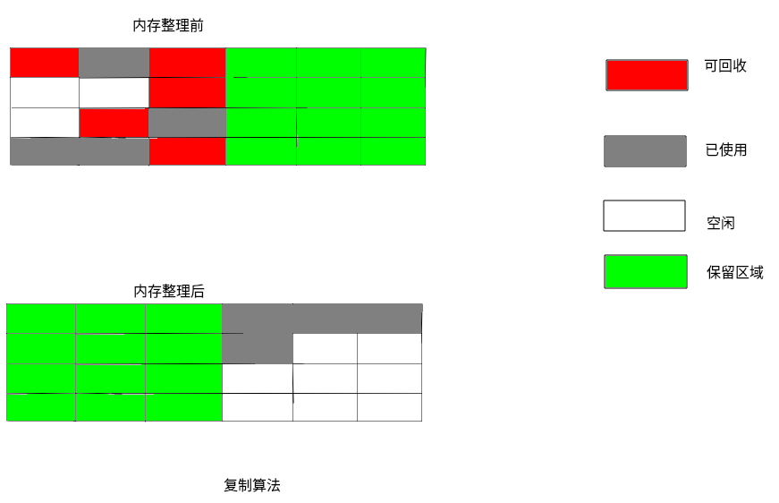         
         
#### 标记-清除算法(Mark-Sweep)
>标记-清除算法分为2个步骤：标记和清除。
>
>首先标记出所有可达(存活)的对象，在标记完成后，
统一回收所有未被标记(不可达)的对象。

标记-清除算法的缺点主要有2个:

1. 标记和清除2个阶段的耗时都比较长，可以总结为效率较低。
2. 对象在内存中的分布可能是不连续的，分散的，
标记-清除后可能造成不连续的内存碎片。当内存碎片过多后，
后续想要分配较大的对象时，无法找到足够大的内存碎片，
可能又需要触发GC。

>标记-清除算法和标记-整理算法一样，一般用于老年代。
>因为老年代中的对象存活率较高，几乎很少被回收，
>所以标记-清除和标记-整理算法GC的时间不会太长，
>GC的对象相比新生代更少。

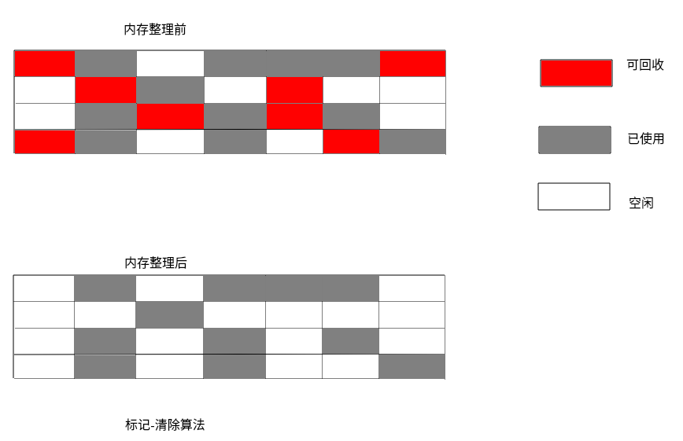
      
#### 标记-整理算法(Mark-Compact)
>标记-整理算法是对标记-清除算法的一种改进。

>标记-整理算法与标记-清除算法的在标记阶段是相同的，
>都是首先标记出所有可达(存活)的对象。
>但标记之后并不直接清理未被标记(不可达)的对象，
>而是使被标记(存活)的对象向内存一端移动，然后清理掉这一端外的内存。
         
**标记-整理算法的优点是:
几乎不会如标记-清除算法那样产生不连续的内存碎片。
但，所谓慢工出细活。标记-整理的效率大多时候都是比标记-清除要低的。**         

标记-整理算法和标记-清除算法一样，一般用于老年代。        
         
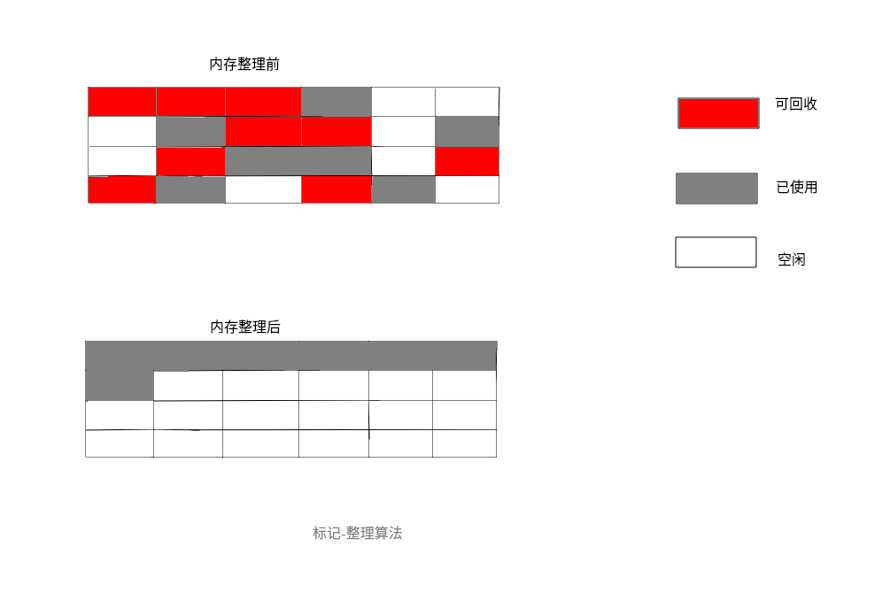         
         
#### 分代收集算法
>分代收集算法并不是指某一种具体的垃圾收集算法，
>而是将复制，标记-清除，标记-整理等算法合理运用到堆区的不同空间，
>比如新生代使用复制算法，老年代使用标记清除或标记整理算法。
>
>现代的几乎所有的JVM都使用分代收集，毕竟每种算法都有优缺点，
>结合它们的特点，对不同的环境采用不同的算法是非常明智的选择。

#### 内存分配与垃圾回收策略
1. 对象优先在eden区域被分配
2. 大对象将直接进入老年代
(大对象是指需要大量连续的内存空间的对象，如长字符串，大数组等。)
3. 长期存活的对象将进入老年代

#### 一次GC的过程
对象优先在eden区被分配，当eden区内存不足时，
JVM发起Minor GC。Minor GC的范围包括eden和From Survivor。

>首先JVM会根据可达性算法标记出所有存活的对象。
>
>如果存活的对象中，有的对象的年龄已经达到晋升阈值
>(阈值是动态计算的，可以通过-XX:MaxTenuringThreshold设置最大的阈值)，
>那么将已经达到阈值的对象复制到老年代中。
>
>如果To Survivor空间不足以存放剩余存活对象，
>则直接将存活的对象提前复制到老年代。
>如果老年代也没有足够的空间存放存活的对象，
>那么将触发Full GC(GC整个堆，包括新生代和老年代)。
>
>如果To Survivor可以存放存活的对象，
>那么将对象复制到To Survivor空间，并清理eden和From Survivor。
>
>此时From Survivor为空，
>那么From Survivor就成为了下一次的To Survivor，
>此时To Survivor存放着存活的对象，就成为了下一次的From Survivor。
>这样From Survivor与To Survivor就是不断交替复制的使用。
>
>同时可以明白,老年代中的对象很多都是不易被回收的对象。

**老年代的空间比新生代的空间要大，
所以老年代的Major GC要比Minor GC耗时更长。
根据垃圾回收器的不同，老年代的GC算法也不同。**

#### 动态年龄阈值
>JVM并不要求对象年龄一定要达到 MaxTenuringThreshold 才会
>晋升到老年代，晋升的年龄阈值是动态计算的。
>如果在Survivor中，某个相同年龄阶段的所有对象大小的总和
>大于Survivor区域的一半，则大于等于这个年龄的所有对象
>可以直接进入老年代，无需等到MaxTenuringThreshold。
         
### 垃圾回收器

**如果说垃圾回收算法是JVM对GC算法的方法论，
那么垃圾回收器就是对GC算法的实现。**

垃圾回收器主要分为以下几种收集器:

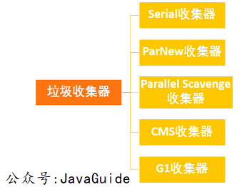

   
#### Serial 串行收集器
>Serial收集器为单线程环境设计,并只使用一个线程进行垃圾回收。
>在回收时，会暂停用户线程,并不适用于并发环境。
>
>Serial收集器在单线程环境中是很高效的,它没有多线程切换的消耗。     

**Serial收集器采用复制算法**

**PS:目前只有Serial和ParNew能作为CMS收集器的新生代收集器。**
       
####  Serial Old 串行收集器(老年代版本)
>它是 Serial收集器的老年代使用的GC收集器，同样是一个单线程的垃圾收集器。 

**Serial Old收集器采用的是标记-整理算法。**
   
````text
   
/** 开启串行收集器使用 -XX:+UseSerialGC , 
  * 这样默认新生代使用 Serial 收集器,
  * 老年代使用 Serial Old 收集器. 
  *
  * 设置VM参数:
  *
  * -XX:+Xlogs:gc* 打印gc信息
  * -XX:+PrintCommandLineFlags  打印java版本信息
  * -XX:+UseSerialGC 使用串行GC
  */                      

//如果程序正常运行,日志会显示 :
// 新生代的信息为:  def new generation.....
// 老年代的信息为:  tenured generation.....

````           
            
#### Parallel Scavenge 并行多线程收集器
>Parallel Scavenge是并行收集器，它使用多个垃圾回收线程一起工作,
>但是仍然会暂停用户线程。
>
>Parallel Scavenge与其它垃圾回收器不同的是它更
>关注于达到可控制的吞吐量。
>
>吞吐量是CPU运行用户应用程序代码的时间与CPU总消耗的时间的比值:
```text
吞吐量 = 应用程序代码运行时间 / (应用程序代码运行时间 + GC时间)
```

**Parallel Scavenge收集器采用复制算法**

   
#### Parallel Old 并行收集器(老年代版本)
>它是 Parallel Scavenge 的老年代版本,同样是一个并行多线程的收集器。

**Parallel Old收集器采用标记-整理算法。**
  
````text
    /**
     * 
     * 设置 Parallel Scavenge 收集器的参数:
     *
     * -XX:+UseParallelGC
     * 
     * ParallelGC老年代默认使用的 Parallel Old GC 回收器
     * 
     * 并行收集器打印的新生代的信息为:
     *  PSYoungGen ....
     *  
     *  老年代的信息为:
     *  ParOldGen ....
     * 
     */
````        
        
        
#### ParNew 多线程收集器
>它可以看做是多线程版的Serial收集器。
>除了多线程外，ParNew收集器与Serial收集器几乎没啥区别。

**PS:目前只有Serial和ParNew能作为CMS收集器的新生代收集器。**
         
**ParNew收集器采用复制算法**

````text
     /**
       * 
       * 设置ParNewGC回收器的参数为:
       * -XX:+UseConcMarkSweepGC
       * 
       */
````           
        
#### CMS 并发标记清除收集器
>Concurrent Mark Sweep,并发标记-清除垃圾回收器。
>它是一款老年代的收集器，是以达到最短回收停顿时间目标的收集器。

**见名知意,CMS收集器使用的是标记-清除回收算法。
   CMS在垃圾回收过程中，用户线程可以同时工作，无需暂停。**

**因为CMS收集器采用的是标记-清除算法，所以回收时可能会产生不连续的内存碎片。**

#### CMS回收内存主要分为以下阶段:
* 初始标记(Stop The World，此阶段会暂停用户线程)
>只是标记与GC ROOT直接关联的对象。

* 并发标记
>对第一个阶段已经标记的对象进行Tracing，标记所有可达的对象。

* 重新标记(Stop The World,此阶段会暂停用户线程)
>在第二个阶段，由于用户程序的运行，可能有些对象之间的引用关系受到了影响，
>所以需要对这部分对象进行重新标记调整。

* 并发清除
>清除所有未被标记的对象。
      
 ````text
    /**
     *
     * 设置 CMS 收集器参数:
     * -XX:+UseConcMarkSweepGC
     *
     * 使用ConcMarkSweepGC收集器后,它的新生代使用的是:
     * ParNew收集器.
     *
     * 当ConcMarkSweepGC收集器出现异常时,会将CMS替换成Serial Old收集器
     *
     * CMS回收分为4个阶段:
     *
     * 初始标记:    (Stop the world 暂停用户线程)
     * 标记与GC Root直接可达的对象.      
     *
     * 并发标记:  
     * 从第一步标记的可达的对象开始,并发的标记所有可达的对象 
     *
     * 重新标记:    (Stop the world 暂停用户线程)
     * 在第二部的并发标记阶段,由于程序运行导致对象间引用的关系发生变化,
     * 就需要重新标记
     *
     * 并发清除:     
     * 这个阶段不暂停用户线程,并且并发的去清除未被标记的对象
     * 
     */
````
#### G1 收集器        
>G1收集器可以说是目前最前沿的一款收集器，它是一款面向服务端的收集器。
>G1收集器无需配合其他收集器就可以管理整个堆内存。
>jdk9开始，G1成为jdk默认使用的垃圾回收器

#### G1回收器的主要特点有:
* 并行和并发
>G1能够充分利用多核cpu的优势，使垃圾回收与用户线程同时运行。

* 可预测的停顿
>降低GC停顿时间是CMS与G1收集器的共同目标。但是除了降低GC停顿时间，
>G1收集器还可以建立可预测的停顿时间模型。(...太np了 =_=)

* 空间整合
>个人认为这是G1收集器不同于其他收集器的最大亮点了。
>在其他收集器中，堆区基本都分为新生代和老年代。
>而在G1收集器中虽然仍然保留了新生代和老年代的概念，
>但已经不再是物理上的分隔了。
>在G1收集器的堆内存模型中，内存被分割成了一块一块大小相等的Region，
>在这些Region中，Region的类型也不同，有eden，survivor，old，humongous之分。
>当有大对象时，对象会被分配到Humongous Region之中。


#### G1收集器回收内存主要分为以下阶段
````text
G1收集器与CMS收集器的回收过程相似
````
* 初始标记(Stop The World,此阶段会暂停用户线程)
>只标记与GC ROOT直接关联的对象。

* 并发标记
>对第一个阶段标记的对象Tracing，标记所有可达的对象。

* 最终标记(Stop The World,此阶段会暂停用户线程)
>在并发标记阶段，由于用户线程执行，可能导致被标记对象之间的引用关系
>发生影响，需要对这些对象进行重新标记调整。

* 筛选回收
>不同于CMS的并发清除，G1收集器首先会对所有Region的回收价值和回收
>成本进行排序,然后再进行回收。这样可以在有限的时间内获得最大的回收率。

````text
    /**
     *
     * 因为我的机器的jdk版本是11,所以无需指定垃圾回收器
     * 指定G1回收器的参数是: -XX:+UseG1GC
     *
     * 1:初始标记:(Stop the world 暂停用户线程)
     *   标记所有与GC Root直接可达的对象
     *
     * 2:并发标记
     *  从第一个阶段标记的对象开始,trace标记
     *
     * 4:最终标记:(Stop the world 暂停用户线程)
     *  在第二步并发标记的阶段,由于程序执行,
     *  导致被标记对象之间的引用关系发生变化,所以需要重新调整标记
     *
     * 5:筛选回收:
     *  和CMS的并发回收不一样,
     *  G1收集器首先会对所有Region的回收价值和回收成本进行排序,
     *  然后再进行回收。
     *  这样可以保证在有限的时间内获得最大的回收率.
     *
     */
```` 

---

### JVM常用参数

#### 堆栈相关
* -Xss
>调整线程栈大小。

* -Xms
>设置堆内存初始化大小。

* -Xmx / -XX:MaxHeapSize=?
>设置堆内存最大值。

* -Xmn / -XX:NewSize=?
>设置新生代大小。
 
* -XX:NewRatio=?
>设置老年代与新生代的空间占比。
>如: -XX:NewRatio=2,那么老年代:新生代=2:1。

* -XX:SurvivorRatio=?
>设置eden与survivor的空间占比。
>如: -XX:SurvivorRatio=2,那么eden:from survivor:to survivor=2:1:1

* -XX:MetaspaceSize=? / -XX:PerGenSize=?
>-XX:MetaspaceSize=9m
>设置元空间的初始化大小为9m,此参数只在jdk8以后的版本有效。
>
>-XX:PerGenSize=9m
>设置永久代的初始化大小为9m，此参数只在jdk8以前的版本有效。

* -XX:MaxMetaspaceSize=? / -XX:MaxPerGenSize=?
>-XX:MaxMetaspaceSize=50m
>设置元空间最大值为50m,此参数只在jdk8以后的版本有效。
>
>-XX:MaxPerGenSize=50m
>设置永久代的最大值为50m,此参数只在jdk8以前的版本有效。

* -XX:+HeapDumpOnOutOfMemoryError
>此参数使程序发生OOM时，dump错误堆栈信息。

* -XX:HeapDumpPath=?
>-XX:HeapDumpPath=/home/log
>此参数指定发生OOM时，dump错误堆栈信息存放的日志文件或目录。
>此参数只在 -XX:+HeapDumpOnOutOfMemoryError 开启时生效。

#### GC相关
* -XX:+PrintGCDetails / -Xlog:gc*
>打印GC的日志信息。 -Xlog:gc* 在我使用的版本(jdk11)是更受推荐的。

* -XX:+TraceClassUnloading / -Xlog:class+unload=info
>打印类卸载的日志信息。 -Xlog:class+unload=info 在我使用的版本(jdk11)是更受推荐的。

* -XX:+UseSerialGC
>使用Serial串行回收器。

* -XX:+UseParallelGC
>使用Parallel并行回收器。

* -XX:ParallelGCThreads=?
>设置并行收集的线程数,如-XX:ParallelGCThreads=5。

* -XX:+UseConcMarkSweepGC
>使用CMS收集器，它默认的新生代搜集器为ParNew。
>可以与参数: -XX:+UseSerialGC 一起使用，就替换掉了ParNew，
>使用Serial作为CMS的新生代收集器。

* -XX:+UseG1GC
>使用G1收集器。

* -XX:MaxTenuringThreshold=?
>设置新生代对象晋升到老年代的最大年龄阈值。


#### 其他
* -server / -client
>-server:以服务端模式运行应用程序，server模式适用于服务端应用程序。
>JVM在此模式下，会对服务端运行效率做很大优化。
>
>-client:以客户端模式运行应用城西，client模式适用于客户端桌面程序(GUI)。
>JVM在此模式下，会对客户端运行做很大优化。

### Java常用调优工具
* jps(个人认为非常重要)
>jps 命令类似于 linux的 ps 命令，不过ps命令是用于查看系统进程的，
>而jps用于查看当前系统运行的java进程。
>
````text
jps -q 只输出java进程id
jps -l 输出java进程main函数的详细路径
jps -v 输出java进程时指定的jvm参数
jps -m 输出java进程执行时main函数的参数
````

* jstat
>jstat用于查看java进程的运行状态.

````text
jstat -class pid    用于查看java进程类的情况
jstat -compiler pid 用于查看java进程编译的情况
jstat -gc pid       用于查看java进程gc的情况
````

* jinfo
>jinfo 查看正在运行的java进程的jvm参数

```text
jinfo -flag MetaspaceSize pid  查看java进程的jvm的元空间大小
jinfo -flag MaxHeapSize pid    查看java进程的jvm的最大堆的大小
...
```

* jmap
>jmap 既可以dump java程序的快照，也可以查看对象的统计信息。

```text
jmap -heap pid               查看java进程堆的信息
jmap -histo pid              查看java进程对象的信息
jmap -dump:file=filename pid 生成java进程jvm的堆快照到指定文件 
```

* jstack
>jstack用于分析java线程栈信息

```text
jstack pid
```

* jconsole
>jconsole 是jdk提供的对java程序进行分析的GUI界面工具。