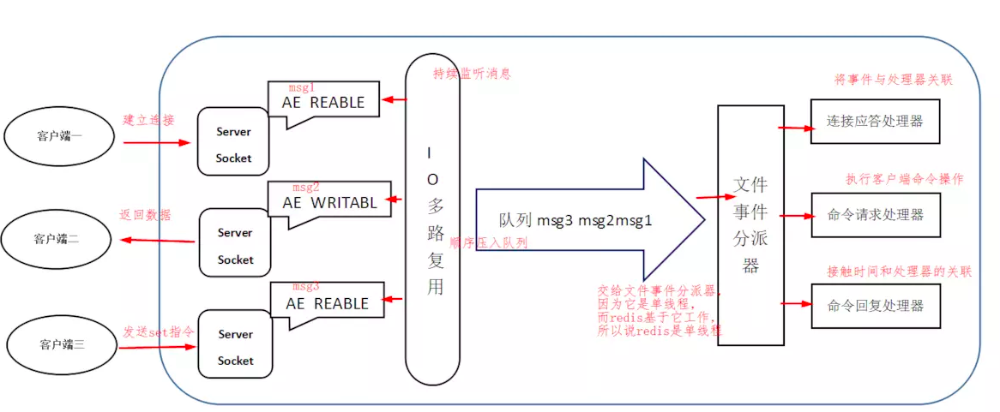
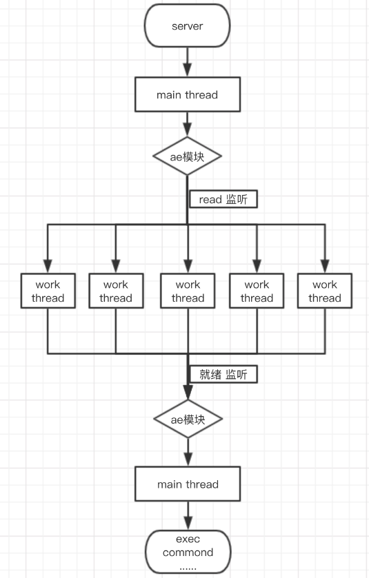
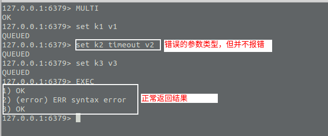

<!-- TOC -->

   * [NoSQL(Not-only SQL)](#nosqlnot-only-sql)
      * [什么是NoSQL数据库?](#什么是nosql数据库)
      * [为什么要有NoSQL数据库?](#为什么要有nosql数据库)
      * [非关系型数据库与关系型数据库的区别](#非关系型数据库与关系型数据库的区别)
      * [有哪些类型的NoSQL数据库?](#有哪些类型的nosql数据库)
   * [Redis](#redis)
      * [什么是Redis?](#什么是redis)
         * [Redis优缺点](#redis优缺点)
         * [Redis为什么这么快?](#redis为什么这么快)
         * [Redis应用场景](#redis应用场景)
         * [为什么不用Map或Guava做缓存?](#为什么不用map或guava做缓存)
         * [Redis和Memcached异同](#redis和memcached异同)
      * [Redis IO模型](#redis-io模型)
         * [Redis 6 之前](#redis-6-之前)
         * [Redis 6 之后](#redis-6-之后)
      * [Redis事务](#redis事务)
         * [Redis事务执行过程](#redis事务执行过程)
         * [Redis事务队列](#redis事务队列)
         * [Redis事务错误](#redis事务错误)
      * [Redis数据结构](#redis数据结构)
      * [Redis缓存淘汰策略(key回收)](#redis缓存淘汰策略key回收)
         * [noeviction](#noeviction)
         * [volatile](#volatile)
         * [allkeys](#allkeys)
      * [Redis持久化](#redis持久化)
         * [RDB(Redis Data Base)](#rdbredis-data-base)
         * [AOF(Append Only File)](#aofappend-only-file)
         * [如何选择持久化策略?](#如何选择持久化策略)

<!-- /TOC -->

## NoSQL(Not-only SQL)

````text
如有错误之处，敬请指教。
````

PS:部分图片源于网络,如有侵权，请联系俺，俺会立刻删除。

### 什么是NoSQL数据库?
>NoSQL数据库泛指非关系型数据库，与关系型数据库不同，非关系型数据库并没有一种固定的存储数据的结构，
>相对来说比较灵活。

### 为什么要有NoSQL数据库?
>个人认为非关系型数据库与关系型数据库是一种相辅相成的关系，起到了互补的作用。
>
>关系型数据库的数据看上去很直观且支持事务，保证了数据的一致性。
>
>非关系型数据库读写速度块，在高并发的压力下仍有不俗的表现且数据结构丰富，
>更多的是对关系型数据库的一种补充。

### 非关系型数据库与关系型数据库的区别
- 存储结构
>关系型数据库按照结构化的方式存储数据，需要先定义好数据库表的字段，
>再存储数据。这样做的好处就是可靠性比较高，但是如果后期应用扩展功能，
>需要扩展表的话，会有些受限。
>
>非关系型数据库存储的结构则不像关系型数据库那样固定，相对来说较为灵活，
>可以根据数据调整数据库的结构。

- 存储方式
>关系型数据库大多采用行和列这样的表格关系存储数据。
>
>非关系型数据库存储数据的方式则不固定，有的采用K-V键值对存储，
>有的采用文档存储，还有的图数据库使用图结构存储。

- SQL标准
>关系型数据库采用结构化的语言SQL来对数据库进行操作，并且SQL已成为大多数数据库的标准规范。
>
>非关系型数据库则各自为战，一直没有一个统一的标准，每种厂商提供的数据库规范都不一样。

- 读写速度
>关系型数据库强调数据的一致性，所以在遇到高并发读写操作时，会显得力不从心。
>
>非关系型数据库强调BASE理论:Basically Available(基本可用),Soft-state(软状态),Eventual Consistency(最终一致性)，
>它允许一定程度的数据不一致，但保证数据的最终一致性。
>因此，面对高并发读写操作时，表现的会比关系型数据库好的多，
>这也是redis,memcached这类高性能的NoSQL数据库被用于缓存的主要原因。

### 有哪些类型的NoSQL数据库?

- K-V键值对: K-V键值对类型的NoSQL数据库类似于Hash表，将数据存储在内存中，
操作速度非常的快，因此常被用于缓存数据库。K-V键值对类型的NoSQL数据库主要有:Memcached,Redis等。

- 文档: 文档类型的NoSQL数据库结构则不固定，无需像关系型数据库一样预先定义字段，它存储数据的方式类似于JSON，
可以清晰的描述数据之间的复杂关系。文档类型的NoSQL数据库主要有:MongoDB,CouchDB等。

- 列式存储: 列式存储的NoSQL数据库以列簇形式存储数据，将同一列的数据存储在一起，
这样可以分割为多列，查询速度是很快的，但是列式存储的数据库功能也会收到限制。
列式NoSQL数据库主要有:HBase等;


- 图结构: 图数据库主要用于构建节点的关系图谱，以图算法和图结构进行计算和存储。
 图数据库主要有:Neo4j等。


## Redis

推荐一个学习Redis的网站: [RedisBook](http://redisbook.com/)

### 什么是Redis?
>Redis是一个使用ANSI C语言编写，遵守BSD协议规范的开源的K-V类型的NoSQL数据库服务器。
>Redis是当前最流行的K-V类型的NoSQL数据库之一，在通往系统架构的方向，它是我们不得不学习的知识。

[Redis官网](https://www.redis.net.cn/)


#### Redis优缺点

- Redis的优点:
  
  - 性能高: 用c语言编写的应用我就没见过慢的~_~。
  
  - 丰富的数据结构: 总体上来说Redis是以K-V形式存储数据，但是细分来说，
                  它支持STRING，HASH，LIST，SET，SORTED_SET，HyperLogLog等多种数据结构。 

  - 支持Lua脚本: Redis使用Lua脚本解释器来执行脚本，所以它支持Lua脚本。
  
  - 支持事务: Redis是为数不多的支持事务的NoSQL数据库之一。
  
  - 支持数据持久化: Redis支持rdb和aof两种数据持久化方式。
  
  - 支持发布者/订阅者功能
  
  - 支持主从模式: Redis支持Sentinel哨兵模式搭建高可用集群配置。

- Redis的缺点:

 - 受限于物理内存: Redis属于内存数据库，它在内存中存储数据的大小是受物理内存限制的，
                 所以它不适合存储海量数据。

#### Redis为什么这么快?

- 内存操作: Redis绝大部分操作都是基于内存的，想不快都难。

- 优秀的数据结构: Redis虽然支持的数据结构众多，但是它的每种数据结构都是专门设计和优化过的。

- 多路复用IO: Redis整体采用多路复用IO模型，核心操作使用单线程处理。

#### Redis应用场景     

- 缓存: 缓存可能是Redis用的最多的场景了。由于Redis的高性能，
高并发场景下作为缓存服务数据库，再适合不过了。
并且Redis支持的key自动过期功能，更是可以定制热点数据的过期时间。

- 多功能业务场景: Redis支持多种丰富的数据结构，不仅可以存储简单的K-V数据，还可以使用Hash存储用户，商品等信息，
List存储有序的数据，Set还有交集，并集，差集等功能。

- 分布式锁: Redis的操作具有原子性的，可以利用这点来完成分布式锁。


#### 为什么不用Map或Guava做缓存?
>因为无论是Map还是Guava，都属于本地缓存，在一个JVM进程内的，如果是单机模式，这样做尚可。
>但如果是分布式或者Java应用有多个实例，那就不能保证每个JVM进程内的缓存是一致的，
>所以需要使用Redis这种第三方数据库作为缓存容器。
   
   
#### Redis和Memcached异同   

- 都属于内存数据库

- 持久化支持: Redis支持RDB和AOF两种持久化机制；
             Memcached只在内存中存储数据，不支持持久化机制。

- 数据结构: Redis从整体上来说是以K-V类型的为存储结构，
        但它细分可以支持String，Hash，List，Set，Sorted Set等数据类型；
        Memcached则只支持K-V类型的存储结构。

- IO模型: Redis是以多路复用IO为模型的设计；
          Memached是以非阻塞IO为模型的设计。

- 事件库: Redis采用自制的AeEven事件库处理Socket事件;
         Memcached采用的是LibEvent事件库。

- 使用场景: 不考虑性能，Redis更适用于需要复杂数据结构，需要持久化的应用，
           如果你的应用以后需要扩展，那么也可以选择Redis；
           Memcached则适用于高并发和只需要K-V数据结构的应用。  

---       
       
### Redis IO模型
Redis IO模型按Redis的版本可以分为Redis 6之前和Redis 6之后。

#### Redis 6 之前
> Redis是基于多路复用IO模型处理Socket请求的，关于多路复用的知识，我在
[Linux五种IO模型中](https://github.com/guang19/framework-learning/blob/dev/jdk_jvm_juc-learning/Jdk&Jvm&Juc.md#%E5%A4%9A%E8%B7%AF%E5%A4%8D%E7%94%A8io%E7%BD%91%E7%BB%9Cio%E6%A8%A1%E5%9E%8B)
>已经说过了：
>多路复用IO模型依赖于操作系统的select/poll/epoll函数，
>epoll函数使得内核不断轮询客户端socket，
>用户进程(线程)也需要阻塞在对epoll函数的调用上，当Socket有事件时，
>用户线程便发起系统调用，处理Socket事件。
>
>多路复用IO模型简单理解就是一个线程处理多个Socket连接。
>所以**可以把Redis看成是单线程模型，但并不是说Redis只有一个线程，
>而是说它执行核心操作的线程只有一个，它还有其他辅助线程完成其它功能。
>Redis这样设计就避免了多线程切换的开销和简化了Redis的设计。**

Redis IO模型:



#### Redis 6 之后
>Redis 6 之前一个线程处理所有的Socket和核心操作，
>这样做的好处就是单线程无需考虑像多线程切换带来的困扰，
>简化了Redis的模型，但随之而来的也有性能上的瓶颈。
>
>**虽然Redis确实够快，但它是在内存中操作的，会收到内存的限制。
>且一个线程处理所有的Socket会带来网络IO的限制，并不能发挥多核CPU的优势。**
>
>那有什么办法既能够发挥多核cpu的优势，又不会复杂化Redis的架构呢？
>
>Redis 6 之前的瓶颈主要在于内存和网络IO。
>
>关于内存这块，只得靠Redis自身的优化和机器条件了，
>但是网络IO这块就可以通过新增多线程来处理大量Socket连接来优化了。
>Redis 6 正是通过新增监听线程来解决网络IO的瓶颈，线程监听到Socket事件后，
>再交由main线程处理。
>所以**整体来说，Redis 6 在处理Socket事件上有单线程优化成了多线程，
>但核心操作还是由单线程执行。**

Redis 6 IO模型：



---

### Redis事务

>Redis的事务主要依赖于WATCH ,UNWATCH,MULTI , EXEC, DISCARD等命令。
>其中 MULTI , EXEC , DISCARD 分别对应关系型数据库的 
>BEGIN,COMMIT,ROLLBACK操作。

#### Redis事务执行过程
>客户端使用MULTI命令开启事务，此时用户就可以开始发出要执行的命令。
>如果命令为WATCH/MULTI/EXEC/DISCARD这四个中的任意一个，
>那么会被直接执行，因为它们属于事务操作。
>当执行DISCARD的时候，会清空事务队列并退出事务。
>如果是普通命令，就将命令加入事务队列，然后当EXEC命令执行时，
>事务中的队列将会被一一执行，最后执行的结果也是一个数组。


参考: [Redis事务的设计与实现](https://redisbook.readthedocs.io/en/latest/feature/transaction.html)

#### Redis事务队列
在开启事务后，用户命令并不会被立刻执行，而是被添加到事务队列中，
这个队列其实是一个数组，每个数组元素由3部分组成:
1. 要执行的命令(cmd)
2. 命令的参数(argv)
3. 参数的数量(argc)

命令被添加到队列中的结构大致如下:


命令被执行后，也会生成一个结果数组，Redis就将这个结果数组返回:


#### Redis事务错误

Redis事务可能有两个错误时机。

- EXEC执行命令之前出现错误
>在EXEC命令之前的错误，也就是开启事务后，用户发出了错误的命令，
>参数数量不对或其他原因，服务端会累积这些错误。
>当EXEC命令执行时，将拒绝执行事务，并返回错误原因，清空事务队列。


- EXEC执行命令时出现错误
>EXEC执行命令时出现错误，也就是用户发出的命令没有错，
>但是在执行命令的时候出现了错误(可能是参数类型不对)，这时候仍然返回结果数组。
>也就是说错误的命令并不影响其他命令的执行。




---

### Redis数据结构

关于Redis数据结构这块，还是推荐学习: [RedisBook](http://redisbook.com/)

>Redis有着非常丰富的数据结构，这些数据结构可以满足非常多的应用场景，
>如果对这些数据结构有一个比较清晰的认知，使用Redis也会更加得心应手。

Redis主要支持以下数据结构:
1. String(字符串)
2. List(双端链表)
3. Hash(Hash字典)
4. Set(无序集合)
5. Sorted Set(有序集合)

|    数据结构  |     描述　           |　实现   | 
|   :----:    |    :----:           | :----: |
| String      | 可以存储字符串，整型和浮点型等类型的数据。适合于简单的K-V数据场景。                        | Redis并没有使用字符数组来实现这一数据类型，而是自己定义了简单动态字符串(SDS: Simple Dynamic String)类型来实现这一数据结构。                |
| List        | 既可以存储操作有序的数据，还可以当做栈来使用，它适合存储列表性质的数据。                    | List在Redis中使用的是双端链表和压缩列表实现的，这就解释了它为什么能在头尾操作元素。 C语言并没有双端链表的实现，所以Redis自定义了这一数据结构。 |
| Hash        | Hash字典，也是关联数组，数组的每个元素都是key到value的映射，它适合存储对象这样的结构化数据。 | Hash在Redis中是使用Hash字典和压缩列表实现的。                                                                                      |
| Set         | Set无序集合，它适合存储需要去重的元素，且有并集，交集，差集等功能在多个Set之间进行比较计算。  |  整数集合是Set的底层实现之一，当集合只有整型元素且元素数量不多的时候，Redis就会使用整数集合来实现Set。当新添加元素的时候，整数集合会根据新元素的类型自动扩容，并将所有元素的类型都转为与新元素一样的类型，在这个过程中，还需要保持原来的顺序不变，最后才添加新元素。 |
| Sorted Set  | Sorted Set有序集合，可以看做加强版的Set。Sorted Set 与  Set不同的是，Sorted Set可以根据元素的score分数进行排序。它适合存储需要排序的不重复的元素。 |  Sorted Set在Redis中使用的是跳表实现的，跳表是一种有序且查询速度很快的数据结构。跳表每个节点都维持指向其他节点的指针，从而达到快速访问的目的。  |

### Redis缓存淘汰策略(key回收)

>**当Redis使用的内存超出物理内存限制时，
>Redis的内存会和Swap(虚拟内存)频繁切换，造成Redis性能的急剧下降。
>为了不让Redis内存占用超过物理内存占用，可以给Redis配置一个 maxmemory 的值，
>当Redis占用内存超过了这个maxamemory的值，
>那么Redis将启用缓存淘汰策略来删除内存中的key，
>缓存淘汰策略可以通过 maxmemory-policy 设置。**

缓存淘汰策略主要分为3类:

1. noeviction
2. volatile
3. allkeys

#### noeviction
noeviction策略是Redis默认的淘汰策略。
**它可以继续接受请求并执行，但是不会执行写请求，
这样做可以保证内存中的数据不会被删除，但是却不能继续完成写请求。**

#### volatile

*volatile只针对 设置了过期时间的key做淘汰。*

volatile有三种算法实现:

1. **volatile-lru**:根据lru算法淘汰设置了过期时间的key，**lru算法优先删除最近最少使用的key**。

2. **volatile-ttl**:根据key的过期时间淘汰设置了过期的key，**过期时间越小的key优先被删除**。

3. **volatile-random**:**随机淘汰设置了过期时间的key**。

#### allkeys

*allkeys对所有key无差别淘汰*

allkeys有两种算法实现:

1. **allkeys-lru**: 根据lru算法淘汰所有的key，最近最少使用的key优先被删除。

2. **allkeys-random**:随机淘汰所有的key。

### Redis持久化

Redis有2种持久化策略: RDB和AOF。

#### RDB(Redis Data Base)

RDB是Redis默认的持久化策略，这种策略是把内存的数据以二进制形式的副本保存在磁盘上。

- RDB持久化触发条件
  
  - SAVE命令: 当客户端执行SAVE命令时，会阻塞Redis主线程进行数据持久化，直到持久化完成。Redis在阻塞期间不能处理客户端的请求。 

  - BGSAVE命令: 当客户端执行BGSAVE命令时，Redis会fork一个子进程进行数据持久化，因此并不会阻塞Redis服务。
  
  - FLUSHALL命令: 当客户端执行FLUSHALL命令时，会清空Redis所有数据库的数据，并且也会触发数据同步。
  
  - save配置: Redis会按照配置文件中的save配置的条件进行数据同步，一旦满足条件，就会执行BGSAVE命令，即fork一个子进程进行同步。
  
  - shutdown: 当Redis服务关闭时，也会将数据同步到磁盘，以便下次启动时恢复。
  
- RDB的优点:
 
  - 文件体积小,恢复大数据较快
  
  - 最大化Redis性能: Redis会fork出子进程进行数据同步，并不影响Redis的性能。

- RDB的缺点:
 
  - 数据安全性较低: 如果不显示的执行SAVE命令，那么Redis隔一段时间才会同步数据，可能会造成一定程度的数据丢失。

#### AOF(Append Only File)

AOF默认情况下是关闭的，当配置选项 appendonly 设置为yes后才会进行AOF的持久化。

appendfsync指定了AOF的同步策略，它有三个可选值。

1. no: no代表Redis不亲自持久化，而是通过系统调用write函数每隔一段时间将数据写入文件。
这种情况下如果服务器发生故障，可能会有数据还没来得及同步就丢失了。

2. always: always表示Redis每次执行写操作都会将数据同步到文件中。
这种策略虽然保证了数据的安全性，但是对Redis的性能会有影响。

3. everysec: everysec是AOF默认的持久化策略，这种策略下，
系统每一秒都会将数据写入文件，兼顾了性能和数据安全性。


- AOF优点:
 
  - 数据安全性较高,秒级丢失

- AOF缺点:

  - 文件体积大,恢复大数据较慢
  
#### 如何选择持久化策略?
>两种持久化方式各有优缺点，可以选择混合的方式进行备份。
>混合持久化后，**文件的内容大部分都是RDB格式的，恢复起来较快。
>以AOF的方式同步也能保证数据的安全性。**

